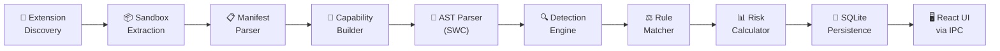
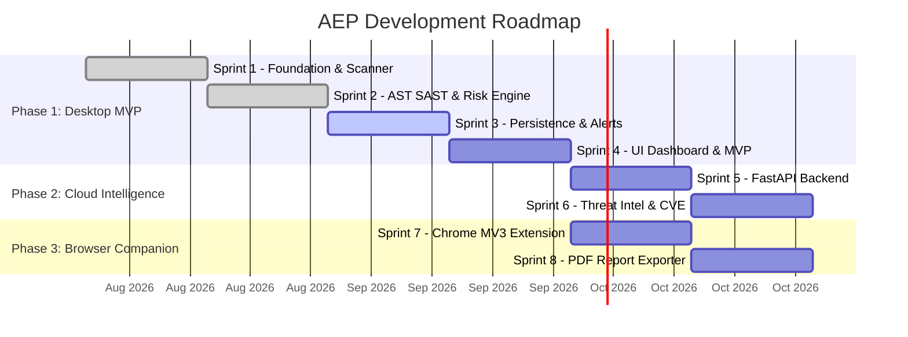

<p align="center">
  
  
  
  
  
  
</p>

<h1 align="center">🛡️ Antigraviiti Extension Protect (AEP)</h1>

<p align="center">
  <strong>AI-Powered Browser Extension Security Platform</strong><br/>
  <em>Offline-first, privacy-by-default desktop agent that performs deterministic static analysis and risk scoring of Chromium browser extensions — entirely on your machine.</em>
</p>

<p align="center">
  
  
  
  
  
  
</p>

---

## Table of Contents

- [Background Story](#-background-story)
- [The Security Problem](#-the-security-problem)
- [Project Goals](#-project-goals)
- [Key Features](#-key-features)
- [Architecture Overview](#-architecture-overview)
- [Analysis Pipeline](#-analysis-pipeline)
- [Project Structure](#-project-structure)
- [Technology Stack](#-technology-stack)
- [Installation](#-installation)
- [Development Setup](#-development-setup)
- [Usage Guide](#-usage-guide)
- [Security Notes](#-security-notes)
- [Development Status](#-development-status)
- [Roadmap](#-roadmap)
- [Contributing](#-contributing)
- [License](#-license)
- [Acknowledgements](#-acknowledgements)

---

## 📖 Background Story

This project was born from a **real security incident**.

The creator's WhatsApp account was compromised after installing what appeared to be a legitimate browser extension. The malicious extension silently injected scripts into WhatsApp Web, harvested session tokens and contact data from the DOM, and exfiltrated private messages to a remote command-and-control server — all without triggering any antivirus alert, firewall rule, or browser warning.

**The root cause was terrifyingly simple**: browser extensions run *inside* the browser renderer process with elevated privileges. They execute *after* TLS decryption, meaning they can read anything visible in the browser — passwords, banking credentials, chat messages, session cookies — before any network security tool even sees the data.

After researching the landscape, it became clear that:
- Most antivirus solutions **do not inspect browser extensions at all**
- Users make a binary "Install / Don't Install" decision with **zero risk visibility**
- Over 47% of Chrome Web Store extensions request broad host permissions like `<all_urls>`
- Enterprise EDR/XDR agents monitor OS processes but are **completely blind** to DOM-level data harvesting

AEP exists to close this gap. Not with vague safety labels, but with **transparent, deterministic, auditable risk metrics** that anyone can verify.

---

## 🔒 The Security Problem

Browser extensions represent one of the most under-monitored attack vectors in modern cybersecurity:

| Threat Vector | Description | Severity |
|:---|:---|:---:|
| **DOM Data Harvesting** | Content scripts injected into messaging apps (WhatsApp Web, Telegram) capture session tokens, contacts, and messages directly from the HTML DOM tree | 🔴 Critical |
| **Permission Creep** | Extensions request `<all_urls>` or `*://*/*`, granting unrestricted access to inspect, modify, or exfiltrate HTTP requests across every visited website | 🔴 Critical |
| **Supply-Chain Hijacking** | Legitimate extensions with thousands of users are silently acquired by malicious entities and weaponized via background updates | 🟠 High |
| **Dynamic Code Execution** | Use of `eval()`, `Function()`, `atob()`, and dynamic `<script>` injection to evade store review processes and load malicious payloads post-install | 🟠 High |
| **Secret Exfiltration** | Hardcoded API keys (AWS, Stripe, OpenAI) and credentials embedded in extension source code leak through static analysis blind spots | 🟡 Medium |
| **C2 Communication** | Background service workers quietly transmit device metadata, browsing history, and keystrokes to unvetted third-party domains | 🔴 Critical |

> **Traditional endpoint security tools (Antivirus, EDR, Firewalls) do not protect against these threats** because extensions operate within the browser's trusted execution context, outside their monitoring scope.

---

## 🎯 Project Goals

1. **Non-Binary Risk Assessment** — Reject simple "safe/malicious" labels. Deliver a normalized risk score (0.0 – 100.0) with itemized, auditable evidence
2. **100% Offline Operation** — All analysis runs locally on the user's machine. No extension data is ever uploaded to any cloud server by default
3. **Deterministic Scoring** — Risk scores are calculated by a mathematical rule engine. No AI black boxes. Every point deduction is traceable to a specific manifest permission, AST pattern, or security rule violation
4. **AI as Narrator, Not Judge** — AI (OpenAI / Ollama) is used strictly to translate raw technical findings into human-readable explanations. It never influences the risk score
5. **Zero-Trust Extension Analysis** — Every extension is treated as potentially hostile until proven otherwise through systematic static analysis

---

## ✨ Key Features

<table>
<tr><td width="50%">

### 🔍 Static Analysis Engine
- Manifest V2 & V3 parsing with permission weight mapping
- SWC-powered AST parser for JavaScript code analysis
- Chrome API call interception (`chrome.tabs`, `chrome.cookies`, etc.)
- Dangerous API detection (`eval()`, `setTimeout` with strings, `importScripts`)
- Hardcoded secret detection (AWS keys, Stripe tokens, API credentials)
- Static call graph generation

</td><td width="50%">

### 📊 Risk Scoring Engine
- Deterministic mathematical scoring (0.0 – 100.0)
- Configurable risk profiles (Default, Strict, Relaxed)
- Aggregation policies: Once, Sum, Max, Decay
- Top-3 contributor breakdown with auditable evidence
- Severity classification: Low → Medium → High → Critical

</td></tr>
<tr><td>

### 🗄️ Persistence & History
- Embedded SQLite 3 with WAL mode for concurrent reads
- Scan report JSON archival with UUID-based tracking
- Schema migrations on cold boot
- Strongly typed domain-to-SQL mapping layer

</td><td>

### 🏗️ Secure Package Handling
- Sandboxed extraction with UUID-scoped ephemeral directories
- Zip-Slip path traversal defense via pre-creation path normalization
- Magic-byte archive format detection (CRX2, CRX3, ZIP)
- RAII-based automatic sandbox cleanup via `SandboxHandle::Drop`
- Extensible validation chain (manifest existence, future: symlink detection, file count limits)

</td></tr>
<tr><td>

### 🖥️ Desktop Integration
- Auto-discovery of extensions across Chrome, Edge, Brave, and Opera profiles
- Tauri v2 IPC bridge connecting React UI to Rust backend
- CPU-heavy AST work offloaded via `tokio::task::spawn_blocking`
- Native OS notifications (Planned — WO #039)

</td><td>

### 🎨 Frontend Architecture
- React 18 + Vite + TypeScript scaffold with dark theme tokens
- Tailwind CSS with `@tailwindcss/forms` and `@tailwindcss/typography`
- Clean service separation: `ipc.ts` → `scanService.ts` / `extensionService.ts`
- Path aliases (`@/*`) synchronized across Vite and TypeScript configs

</td></tr>
</table>

---

## 🏛️ Architecture Overview

AEP is built on **Clean Architecture** (Hexagonal / Ports & Adapters) with strict dependency inversion:

```
┌─────────────────────────────────────────────────────────────────┐
│                     PRESENTATION LAYER                          │
│  Tauri IPC Commands (Adapter) │ React UI │ IPC DTOs             │
│  AppState (Composition Root)  │ Services │ TypeScript Types     │
├─────────────────────────────────────────────────────────────────┤
│                     APPLICATION LAYER                           │
│  AnalysisPipeline │ ManifestService │ CapabilityBuilder         │
│  RuleEngine │ RiskEngine │ DiscoveryService │ ExtractionService │
│  ASTWalker │ Detectors │ CallGraphBuilder │ RuleMatcherService  │
├─────────────────────────────────────────────────────────────────┤
│                       DOMAIN LAYER                              │
│  Entities (Manifest, Extension, Permission)                     │
│  Value Objects (RiskScore, Severity, BrowserFamily, SandboxId)  │
│  Domain Rules (RuleSet, Finding, Evidence, RiskAssessment)      │
│  Traits & Contracts (no framework dependencies)                 │
├─────────────────────────────────────────────────────────────────┤
│                    INFRASTRUCTURE LAYER                         │
│  SWC AST Parser │ SQLite Repository │ ManifestParser (JSON)     │
│  Filesystem Scanner │ Archive Extractors (ZIP, CRX)             │
│  DatabaseManager │ SandboxHandle (RAII Drop)                    │
└─────────────────────────────────────────────────────────────────┘
```

**Key architectural rules enforced across the codebase:**
- **Domain** has zero dependencies on any framework, filesystem API, or external crate
- **Application** depends only on Domain abstractions (traits), never on Infrastructure
- **Infrastructure** implements Domain traits with concrete adapters (SQLite, filesystem, SWC)
- **Presentation** acts purely as an adapter layer — IPC commands translate DTOs, never contain business logic

---

## 🔬 Analysis Pipeline

The complete data flow from extension discovery to risk assessment:



<details>
<summary><strong>Pipeline stage details (click to expand)</strong></summary>

| Stage | Module | Description |
|:---|:---|:---|
| **1. Discovery** | `application::discovery` | Scans Chrome, Edge, Brave, Opera profile directories on Windows/macOS/Linux to locate installed extensions |
| **2. Sandbox Extraction** | `application::extraction` | Creates UUID-scoped ephemeral directories, extracts `.crx`/`.zip` archives with Zip-Slip defense using pre-creation path normalization and magic-byte format detection |
| **3. Manifest Parser** | `application::manifest` | Deserializes `manifest.json` (V2 & V3) via `serde_json` with 10MB size guard. Extracts permissions, content scripts, background config, web accessible resources |
| **4. Capability Builder** | `application::analysis` | Normalizes and merges cross-version permissions into a unified `ExtensionCapabilityModel` with structured capability collections |
| **5. AST Parser** | `infrastructure::ast` | Parses JavaScript files into Abstract Syntax Trees using SWC (Speedy Web Compiler) natively in Rust |
| **6. Detection Engine** | `application::ast_detector` | Runs specialized detectors: Chrome API calls, dangerous APIs (`eval`, `Function`), hardcoded secrets (AWS, Stripe, OpenAI keys), and builds static call graphs |
| **7. Rule Matcher** | `application::rules` | Evaluates structural rule conditions (`Exists`, `Equals`, `CountGreaterThan`, `StartsWith`) against the capability model to produce typed findings with evidence |
| **8. Risk Calculator** | `application::risk` | Computes deterministic risk score (0.0–100.0) using aggregation policies (Once, Sum, Max, Decay). Generates top-3 contributor breakdown and severity classification |
| **9. Persistence** | `application::persistence` | Archives scan reports as JSON to embedded SQLite 3 (WAL mode) with UUID-based tracking and transactional schema migrations |
| **10. IPC Bridge** | `presentation::commands` | Exposes `get_installed_extensions` and `scan_extension` as Tauri IPC commands. CPU-heavy work offloaded to OS threads via `spawn_blocking` |

</details>

---

## 📂 Project Structure

```
ExtensionProtect/
├── src-tauri/                      # Rust Backend (Tauri v2 Desktop Agent Core)
│   ├── Cargo.toml                  # Rust dependencies & build config
│   └── src/
│       ├── main.rs                 # Binary entry point
│       ├── lib.rs                  # App bootstrap & Composition Root (AppState)
│       ├── domain/                 # Pure domain layer (zero external dependencies)
│       │   ├── entities.rs         # Manifest, Extension, Permission aggregates
│       │   ├── types.rs            # RiskScore, Severity, BrowserFamily value objects
│       │   ├── errors.rs           # Strongly typed domain errors
│       │   ├── capabilities.rs     # ExtensionCapabilityModel
│       │   ├── rules.rs            # RuleSet, Rule, Finding, Evidence
│       │   ├── risk.rs             # RiskProfile severity classification
│       │   ├── risk_calculator.rs  # RiskAssessment, RiskBreakdown, AggregationPolicy
│       │   ├── ast.rs              # AST node abstractions
│       │   ├── call_graph.rs       # Function, Edge, CallGraph types
│       │   ├── chrome_api.rs       # Chrome API detection types
│       │   ├── dangerous_api.rs    # Dangerous API sink types
│       │   ├── secret_detector.rs  # Secret pattern & confidence types
│       │   ├── rule_matcher.rs     # Rule condition & finding types
│       │   ├── extraction.rs       # Sandbox & archive extraction contracts
│       │   └── persistence.rs      # Repository abstractions
│       ├── application/            # Use-case orchestration layer
│       │   ├── pipeline/           # AnalysisPipeline (single & batch)
│       │   ├── manifest/           # ManifestService, Validator, Mapper
│       │   ├── analysis/           # CapabilityBuilder
│       │   ├── rules/              # RuleEngine
│       │   ├── risk/               # RiskEngine calculator
│       │   ├── discovery/          # Extension auto-discovery service
│       │   ├── extraction/         # ExtractionService, SandboxValidator
│       │   ├── ast/                # AST parsing orchestration
│       │   ├── ast_walker/         # RecursiveWalker (SWC)
│       │   ├── ast_detector/       # Detector inventory & dispatch
│       │   ├── call_graph/         # StaticCallGraphBuilder
│       │   └── persistence/        # Persistence service
│       ├── infrastructure/         # Concrete adapter implementations
│       │   ├── db.rs               # DatabaseManager (SQLite + WAL)
│       │   ├── db/                 # SQLite repositories
│       │   ├── ast/                # SWC parser integration
│       │   ├── ast_walker/         # SWC walker implementation
│       │   ├── manifest/           # JSON manifest deserializer
│       │   ├── extraction/         # ZIP/CRX extractors, SandboxHandle (RAII)
│       │   ├── rules/              # JSON rule source loader
│       │   └── scanner/            # Filesystem scanner
│       └── presentation/           # Tauri IPC adapter layer
│           ├── commands.rs         # #[tauri::command] handlers
│           ├── state.rs            # AppState composition root
│           └── models.rs           # IPC-specific DTOs
├── src/                            # React Frontend (TypeScript)
│   ├── App.tsx                     # Root React component
│   ├── main.tsx                    # Vite entry point
│   ├── index.css                   # Global styles & Tailwind imports
│   ├── layout/                     # AppLayout, Header components
│   ├── components/                 # Reusable UI components (scaffold)
│   ├── features/                   # Feature-scoped views (scaffold)
│   ├── services/                   # IPC wrappers & business services
│   │   ├── ipc.ts                  # Tauri invoke() abstraction
│   │   ├── scanService.ts          # Scan trigger & result handling
│   │   └── extensionService.ts     # Extension discovery service
│   ├── types/                      # TypeScript interfaces mirroring Rust DTOs
│   │   └── ipc.ts                  # ScanExtensionRequest/Response types
│   └── styles/                     # Design tokens (scaffold)
├── docs/                           # 44 engineering documents
│   ├── SYSTEM_ARCHITECTURE.md      # C4 architecture blueprint
│   ├── TECHNOLOGY_STACK.md         # Technology evaluation decisions
│   ├── ENGINEERING_PRINCIPLES.md   # Engineering handbook & SSDLC
│   ├── TASK_BOARD.md               # Sprint task tracking
│   ├── CHANGELOG.md                # Versioned change history
│   └── adr/                        # Architecture Decision Records
├── package.json                    # NPM config & scripts
├── vite.config.ts                  # Vite build configuration
├── tsconfig.json                   # TypeScript compiler options
├── tailwind.config.ts              # Tailwind CSS configuration
└── postcss.config.js               # PostCSS pipeline
```

---

## 🛠️ Technology Stack

| Layer | Technology | Purpose |
|:---|:---|:---|
| **Desktop Framework** | Tauri v2 | Native desktop shell using OS WebView (15–30 MB RAM vs Electron's 150+ MB) |
| **Backend Language** | Rust (Edition 2021) | Memory-safe, zero-cost abstractions, multi-threaded AST analysis |
| **AST Parser** | SWC (Speedy Web Compiler) | Native Rust JavaScript/TypeScript parser — 20x faster than Babel |
| **Local Database** | SQLite 3 + rusqlite | Embedded persistence with WAL mode for concurrent access |
| **Async Runtime** | Tokio | Full-featured async runtime with `spawn_blocking` for CPU-heavy work |
| **Frontend Framework** | React 18 + TypeScript | Component-based UI with strict type safety |
| **Build Tool** | Vite 5 | Sub-second HMR and optimized production builds |
| **CSS Framework** | Tailwind CSS 3.4 | Utility-first styling with dark theme tokens |
| **Serialization** | serde + serde_json | Zero-copy JSON serialization for manifest parsing and IPC |
| **Error Handling** | thiserror | Strongly typed error hierarchies without runtime panics |
| **Observability** | tracing + tracing-subscriber | Structured logging throughout the Rust pipeline |

---

## 📦 Installation

### Prerequisites

- **Rust** (1.75+) — [Install via rustup](https://rustup.rs/)
- **Node.js** (18+) and **npm** — [Download](https://nodejs.org/)
- **Tauri v2 CLI** — Install after Rust:
  ```bash
  cargo install tauri-cli --version "^2.0.0"
  ```
- **System WebView**:
  - Windows: WebView2 (pre-installed on Windows 10/11)
  - macOS: WebKit (built-in)
  - Linux: `webkit2gtk-4.0` (install via package manager)

### Clone & Install

```bash
git clone https://github.com/antigraviiti/extension-protect.git
cd extension-protect

# Install frontend dependencies
npm install

# Verify Rust toolchain
cd src-tauri && cargo check && cd ..
```

---

## 🚀 Development Setup

```bash
# Start the full Tauri development environment (Rust + React HMR)
cargo tauri dev

# Frontend-only development (without Rust backend)
npm run dev

# Type checking
npm run typecheck

# Linting
npm run lint

# Production build
npm run build
```

### Useful Rust commands

```bash
cd src-tauri

# Run Rust unit tests
cargo test

# Check compilation without building
cargo check

# Build optimized release binary
cargo build --release
```

---

## 📖 Usage Guide

### Example Workflow

```
1. Launch AEP Desktop Agent
   └─→ Application boots, initializes SQLite database (WAL mode)
   └─→ Analysis pipeline services are injected into AppState

2. Discover Installed Extensions
   └─→ Click "Scan" → triggers `get_installed_extensions` IPC command
   └─→ Discovery engine scans Chrome/Edge/Brave/Opera profile directories
   └─→ Returns list of ExtensionSummaryResponse DTOs to React UI

3. Analyze an Extension
   └─→ Select extension → triggers `scan_extension` IPC command
   └─→ Pipeline executes: Manifest → Capability → Rules → Risk
   └─→ CPU-heavy work runs on dedicated OS thread (spawn_blocking)
   └─→ Returns ScanExtensionResponse with risk score and severity

4. Review Results
   └─→ Risk Score: 0.0 – 100.0 (deterministic, auditable)
   └─→ Severity: Low | Medium | High | Critical
   └─→ Breakdown: Top contributors with evidence trail
   └─→ Results persisted to local SQLite for history
```

### Risk Score Interpretation

| Score Range | Severity | Meaning |
|:---:|:---:|:---|
| 0.0 – 20.0 | 🟢 **Low** | Minimal risk. Extension requests reasonable permissions |
| 20.1 – 50.0 | 🟡 **Medium** | Moderate risk. Some broad permissions or questionable API usage detected |
| 50.1 – 80.0 | 🟠 **High** | Significant risk. Broad host access, dangerous API calls, or suspicious patterns |
| 80.1 – 100.0 | 🔴 **Critical** | Severe risk. Multiple high-severity findings. Immediate review recommended |

---

## 🔐 Security Notes

- **Zip-Slip Protection**: All archive extraction paths are validated via in-memory normalization *before* any file is created. Paths attempting directory traversal (`../`) are rejected
- **Sandboxed Extraction**: Archives are extracted into UUID-scoped ephemeral directories with RAII cleanup (`SandboxHandle::Drop`) ensuring no residual files
- **Magic-Byte Detection**: Archive formats are identified by file header signatures (not filename extensions), preventing format spoofing
- **No `unsafe` Code**: Zero `unsafe` blocks in production code
- **No Runtime Panics**: Production code avoids `unwrap()`, `expect()`, and `panic!()` (except at application boot entry points, which are documented as known technical debt)
- **Domain Isolation**: Presentation layer uses dedicated DTOs (`ScanExtensionRequest`, `ScanExtensionResponse`) — internal domain models are never serialized directly to the frontend
- **Privacy by Default**: All analysis runs locally. No extension data, scan results, or user information is transmitted to any external server

---

## 📊 Development Status

### Completed Work Orders (WO #026 – #038)

| WO | Task | Sprint | Status |
|:---:|:---|:---:|:---:|
| #026 | SWC Rust AST Parser Integration | S2 | ✅ Done |
| #027 | AST Walker Foundation | S2 | ✅ Done |
| #028 | AST Visitor & Detector Foundation | S2 | ✅ Done |
| #029 | Call Graph Foundation | S2 | ✅ Done |
| #030 | Chrome API Detector | S2 | ✅ Done |
| #031 | Dangerous API Detector | S2 | ✅ Done |
| #032 | Secret Detector | S2 | ✅ Done |
| #033 | Rule Matcher Foundation | S2 | ✅ Done |
| #034 | Risk Score Calculator | S2 | ✅ Done |
| #035 | SQLite Persistence Repository | S3 | ✅ Done |
| #036 | Sandboxed Unpacker & Zip-Slip Defense | S1 | ✅ Done |
| #037 | React 18 + Vite Frontend Scaffold | S1 | ✅ Done |
| #038 | Tauri IPC Commands Wiring | S1 | ✅ Done |

### Sprint Completion Summary

```
Sprint 1 (Desktop Agent Foundation)    ████████████████████ 100%  (10/10 tasks)
Sprint 2 (AST SAST & Risk Engine)      ████████████████████ 100%  (9/9 tasks)
Sprint 3 (Persistence, Alerts & AI)    █████░░░░░░░░░░░░░░░  25%  (1/4 tasks)
Sprint 4 (UI Dashboard & MVP Polish)   ░░░░░░░░░░░░░░░░░░░░   0%  (planned)
```

### Known Limitations (v0.1.0)

- **AST analysis scope**: The current risk score is derived from manifest metadata (permissions, host patterns). Full JavaScript file AST deep-inspection produces findings but is not yet wired end-to-end into the risk score
- **No dynamic analysis (DAST)**: AEP is strictly a SAST tool. It does not execute extensions in a sandbox browser
- **Browser discovery**: The discovery engine locates profiles on disk, but manual extension path entry is also supported
- **UI components**: The frontend scaffold is complete with IPC wiring, but dashboard visualization components (cards, charts, forensic inspectors) are planned for Sprint 4

---

## 🗺️ Roadmap



### Upcoming Milestones

| Phase | Milestone | Key Deliverables |
|:---|:---|:---|
| **Phase 1** (Sprint 3–4) | Desktop MVP v1.0 | Native OS notifications, PII path sanitization, Ollama AI adapter, React dashboard UI, extension health cards, scan history timeline, `.msi`/`.dmg`/`.AppImage` installers |
| **Phase 2** (Sprint 5–6) | Cloud Intelligence | FastAPI backend, PostgreSQL analytics DB, SHA-256 hash matching, NVD CVE cross-referencing, Celery + Redis async workers |
| **Phase 3** (Sprint 7–8) | Browser Companion | Chrome MV3 companion extension with toolbar risk badge, WebSocket IPC bridge to Desktop Agent, executive PDF compliance reports |
| **Phase 4** (Sprint 9–12) | Enterprise Fleet | Multi-tenant CISO console, fleet-wide extension governance, SOC 2 audit export |

### Future Improvements

- [ ] Progress events for real-time scan status updates (`scan-progress` Tauri events)
- [ ] Scan cancellation via propagated `CancellationToken` bindings
- [ ] In-app toast notifications as fallback when OS notifications are muted
- [ ] Firefox `.xpi` extension support
- [ ] Declarative Net Request (DNR) rule evaluation for MV3 ad-blockers
- [ ] Multi-language localization parsing (`_locales/`)
- [ ] Graceful boot error dialog replacing `expect()` at application startup

---

## 🤝 Contributing

This project is currently in active private development. Contribution guidelines will be published when the repository transitions to open-source.

If you are interested in contributing to browser extension security research, please reach out via the project's issue tracker.

---

## 📄 License

This project is currently under a **proprietary license**. License terms will be finalized prior to the v1.0 public release.

---

## 🙏 Acknowledgements

- [**Tauri**](https://tauri.app/) — Lightweight, secure desktop application framework
- [**SWC**](https://swc.rs/) — Blazing-fast Rust-based JavaScript/TypeScript compiler used for AST parsing
- [**rusqlite**](https://github.com/rusqlite/rusqlite) — Ergonomic Rust bindings for SQLite
- [**Tokio**](https://tokio.rs/) — Asynchronous runtime powering the analysis pipeline
- [**React**](https://react.dev/) — Component-based UI framework
- [**Vite**](https://vitejs.dev/) — Next-generation frontend tooling
- [**Tailwind CSS**](https://tailwindcss.com/) — Utility-first CSS framework
- The global browser extension security research community whose published findings on DOM harvesting, supply-chain attacks, and permission abuse patterns directly informed AEP's detection rules

## Development Setup

- **Node.js**: Minimum version 18+ (for frontend toolchain).
- **Rust**: Latest stable version (via `rustup`).
- **Visual Studio Build Tools**: Required for Windows (MSVC).
- **SQLite**: Required for local database functionality.
- **npm install**: Install frontend dependencies.
- **cargo check**: Verify Rust dependencies in `src-tauri`.
- **cargo tauri dev**: Start the development server.

## Project Assets

> **Note**: The `src-tauri/icons/` folder is a **mandatory** part of the repository because it is strictly required by the Tauri build process. If the icons folder is removed or omitted from version control, the build will fail.

---

<p align="center">
  <strong>Built with 🛡️ by the Antigraviiti Security Engineering Team</strong><br/>
  <em>"Illuminating the browser's blind spot — one extension at a time."</em>
</p>
