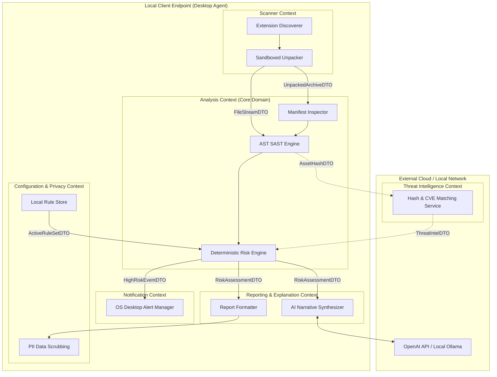

# Bounded Context Specification — Antigraviiti Extension Protect (AEP)

---

## 1. Document Information

| Metadata Field | Document Detail |
| :--- | :--- |
| **Document Title** | AEP Authoritative Bounded Context Specification (Domain-Driven Design) |
| **Document ID** | `DOC-CTX-001` |
| **Current Status** | DRAFT — Pending CTO Architecture Sign-Off |
| **Document Version** | `1.0.0` |
| **Document Owner** | Lead Software Architect & Systems Analyst |
| **Technical Reviewer** | Chief Technology Officer (CTO) / Security Architect |
| **Last Updated** | 2026-08-04 |
| **Target Audience** | Software Architects, Systems Analysts, Backend Engineers, Desktop Engineers, and Security Leads |
| **Source References** | [`docs/DOMAIN_MODEL.md`](file:///d:/ExtensionProtect/docs/DOMAIN_MODEL.md), [`docs/PROJECT_PRINCIPLES.md`](file:///d:/ExtensionProtect/docs/PROJECT_PRINCIPLES.md), [`docs/ENGINEERING_PRINCIPLES.md`](file:///d:/ExtensionProtect/docs/ENGINEERING_PRINCIPLES.md), [`docs/PRODUCT_REQUIREMENTS.md`](file:///d:/ExtensionProtect/docs/PRODUCT_REQUIREMENTS.md), [`docs/FEATURE_CATALOG.md`](file:///d:/ExtensionProtect/docs/FEATURE_CATALOG.md), [`docs/USE_CASE.md`](file:///d:/ExtensionProtect/docs/USE_CASE.md), [`docs/adr/ADR-001_OFFLINE_FIRST_ARCHITECTURE.md`](file:///d:/ExtensionProtect/docs/adr/ADR-001_OFFLINE_FIRST_ARCHITECTURE.md) |

---

## 2. Document Purpose & Strategic Alignment

### 2.1 Why Bounded Contexts Exist
In **Domain-Driven Design (DDD)**, a **Bounded Context** establishes an explicit, inviolable boundary within which a domain model, its terminology, entities, and business rules maintain absolute internal consistency. Without explicit context boundaries, software architectures inevitably degrade into monolithic entanglements where domain models become conflated, entity responsibilities overlap, and security invariants are corrupted.

### 2.2 Why AEP Requires Multiple Bounded Contexts
**Antigraviiti Extension Protect (AEP)** operates across distinct operational domains—from local endpoint discovery and archive unpacking, to AST static code parsing, deterministic risk scoring, threat intelligence matching, AI explanation, and enterprise fleet management.

Establishing strict Bounded Contexts delivers critical architectural benefits:
1. **Enforces Clean Architecture**: Defines clear module boundaries that directly govern future backend microservices, desktop agent sub-modules, and API gateway routing.
2. **Eliminates Shared Entity Ambiguity**: Ensures every domain entity has exactly **one owning context**, preventing duplicate state mutations across modules.
3. **Guarantees Security Isolation**: Prevents untrusted file parsing code in the Scanner Context from directly modifying scoring calculations in the Analysis Context.
4. **Supports Multi-Release Scalability**: Allows sub-systems (such as Threat Intelligence or Enterprise Governance) to evolve or scale independently without breaking core static analysis engines.

### 2.3 Relationship with the Domain Model
While [`docs/DOMAIN_MODEL.md`](file:///d:/ExtensionProtect/docs/DOMAIN_MODEL.md) defines the strategic entities, value objects, and domain events across the platform, this document defines the **organizational and operational boundaries** that group those entities into encapsulated, decoupled sub-systems.

---

## 3. The Bounded Context Map

AEP is partitioned into six core Bounded Contexts for Version 1.0 - 3.0, and one auxiliary Enterprise Governance Context for Version 5.0:

```
+-----------------------------------------------------------------------------------+
|                            AEP BOUNDED CONTEXT MAP                                |
+-----------------------------------------------------------------------------------+
|                                                                                   |
|  [ 1. SCANNER CONTEXT ]                                                           |
|    - Local Extension Profile Auto-Discovery & Sandboxed Archive Ingestion          |
|                                                                                   |
|  [ 2. ANALYSIS CONTEXT ] (Core Domain Boundary)                                   |
|    - Manifest Parsing, Permission Audit, AST SAST, Deterministic Risk Scoring    |
|                                                                                   |
|  [ 3. THREAT INTELLIGENCE CONTEXT ]                                               |
|    - Cryptographic Asset Hash Correlation (SHA-256) & NVD CVE Library Lookups     |
|                                                                                   |
|  [ 4. REPORTING & EXPLANATION CONTEXT ]                                           |
|    - Itemized Score Logs, AI Qualitative Narrative Synthesis, PDF Exporting       |
|                                                                                   |
|  [ 5. NOTIFICATION CONTEXT ]                                                      |
|    - Local Native OS Desktop Banners & SIEM Telemetry Alerts                      |
|                                                                                   |
|  [ 6. CONFIGURATION & PRIVACY CONTEXT ]                                           |
|    - Local Offline Settings, Data Sanitization Rules, Rule Updates Sync           |
|                                                                                   |
|  -------------------------------------------------------------------------------  |
|                                                                                   |
|  [ 7. ENTERPRISE GOVERNANCE CONTEXT ] (Auxiliary Context - Version 5.0)           |
|    - Multi-Tenant Fleet Dashboard, Enterprise Threshold Rules, MDM Policy Sync   |
|                                                                                   |
+-----------------------------------------------------------------------------------+
```

---

## 4. Itemized Bounded Context Responsibilities

---

### 4.1 Context 1: Scanner Context

```
+-----------------------------------------------------------------------------------+
|                               SCANNER CONTEXT                                     |
+-----------------------------------------------------------------------------------+
| RESPONSIBILITIES : Local profile discovery, archive unpacking, Zip-Slip defense  |
| INPUTS           : Browser installation paths, user drag-and-drop file paths     |
| OUTPUTS          : Sanitized raw asset file streams, uncompressed sandbox paths  |
| INTERNAL ENTITIES: UnpackedArchive, ExtensionFileStream                         |
| OUT OF SCOPE     : Manifest parsing, AST SAST, Risk Scoring, CVE matching          |
+-----------------------------------------------------------------------------------+
```

#### Detailed Specification
- **Core Responsibilities**: Auto-discovers installed extension directories across local browser profiles (Chrome, Edge, Brave, Opera); accepts manual drag-and-drop `.crx` / `.zip` file uploads; safely unpacks archive packages into ephemeral sandbox extraction directories; enforces Zip-Slip path-traversal validation and Zip-Bomb size caps ([`ENGINEERING_PRINCIPLES.md`, Section 4.10](file:///d:/ExtensionProtect/docs/ENGINEERING_PRINCIPLES.md#410-defense-in-depth)).
- **Inputs**: Local filesystem path strings, drag-and-drop file streams.
- **Outputs**: Verified, uncompressed file trees in sandboxed temporary storage; raw manifest JSON streams.
- **Internal Ownership**: Owns ephemeral archive handles and extraction file pointers.
- **Explicit Out of Scope**: Must NEVER parse `manifest.json` semantics, MUST NEVER analyze JavaScript AST nodes, MUST NEVER calculate Risk Scores.

---

### 4.2 Context 2: Analysis Context (Core Domain)

```
+-----------------------------------------------------------------------------------+
|                               ANALYSIS CONTEXT                                    |
+-----------------------------------------------------------------------------------+
| RESPONSIBILITIES : Manifest parsing, AST SAST, Deterministic Risk Scoring Engine  |
| INPUTS           : Uncompressed manifest JSON & JavaScript file asset streams    |
| OUTPUTS          : Finding entities, Manifest entity, RiskAssessment entity       |
| INTERNAL ENTITIES: Extension, Manifest, Permission, Finding, RiskAssessment, Rule |
| OUT OF SCOPE     : Disk unpacking, threat intel hash lookup, LLM prompt calling   |
+-----------------------------------------------------------------------------------+
```

#### Detailed Specification
- **Core Responsibilities**: Encapsulates the core business engine of AEP. Parses `manifest.json` structures (V2 vs V3); audits requested host permissions (`<all_urls>`) and dangerous APIs (`cookies`, `scripting`, `debugger`); executes AST static code analysis to detect dynamic execution (`eval()`, `Function()`, `atob()`), obfuscation, and hardcoded secrets; calculates deterministic mathematical Risk Scores ($0.0 - 100.0$) and compiles itemized point deduction logs ([`PROJECT_PRINCIPLES.md`, Principle 10](file:///d:/ExtensionProtect/docs/PROJECT_PRINCIPLES.md#principle-10-explainable--deterministic-risk-scoring-risk-score-harus-deterministik--transparan)).
- **Inputs**: Raw manifest streams and JavaScript asset streams provided by Scanner Context.
- **Outputs**: Completed `Extension`, `Manifest`, `Permission`, `Finding`, and `RiskAssessment` domain entities.
- **Internal Ownership**: Primary owner of core domain entities (`Extension`, `Manifest`, `Permission`, `Finding`, `RiskAssessment`, `Rule`).
- **Explicit Out of Scope**: Must NEVER perform direct disk unpacking, MUST NEVER execute HTTP calls to external threat databases, MUST NEVER invoke Generative AI prompts.

---

### 4.3 Context 3: Threat Intelligence Context

```
+-----------------------------------------------------------------------------------+
|                         THREAT INTELLIGENCE CONTEXT                               |
+-----------------------------------------------------------------------------------+
| RESPONSIBILITIES : SHA-256 asset hash matching, C2 blocklists, CVE JS auditing   |
| INPUTS           : Asset SHA-256 cryptographic hashes, JS library version strings  |
| OUTPUTS          : ThreatIntelligence match entity, CVE vulnerability records    |
| INTERNAL ENTITIES: ThreatIntelligence                                             |
| OUT OF SCOPE     : AST parsing, risk score calculation, OS banner dispatch        |
+-----------------------------------------------------------------------------------+
```

#### Detailed Specification
- **Core Responsibilities**: Manages cryptographic asset hash lookup caches (`SHA-256`); audits third-party embedded JavaScript libraries against NVD CVE vulnerability databases; identifies hardcoded Command & Control (C2) domains and malicious extension campaign signatures.
- **Inputs**: Cryptographic asset hashes and library version strings emitted by Analysis Context.
- **Outputs**: `ThreatIntelligence` domain match entities containing malware hash flags and CVE records.
- **Internal Ownership**: Sole owner of `ThreatIntelligence` entity.
- **Explicit Out of Scope**: Must NEVER parse AST code syntax, MUST NEVER alter scoring rules, MUST NEVER dispatch local OS notifications.

---

### 4.4 Context 4: Reporting & Explanation Context

```
+-----------------------------------------------------------------------------------+
|                       REPORTING & EXPLANATION CONTEXT                             |
+-----------------------------------------------------------------------------------+
| RESPONSIBILITIES : Itemized score log formatting, AI qualitative narrative, PDF   |
| INPUTS           : Completed RiskAssessment entity & Finding entities list        |
| OUTPUTS          : Report entity (JSON structure, Plain AI Narrative, PDF)       |
| INTERNAL ENTITIES: Report                                                         |
| OUT OF SCOPE     : Numerical score computation, AST SAST, disk file scanning     |
+-----------------------------------------------------------------------------------+
```

#### Detailed Specification
- **Core Responsibilities**: Formats itemized mathematical point deduction logs; orchestrates qualitative AI narrative summaries using OpenAI API or local Ollama instances ([`PROJECT_PRINCIPLES.md`, Principle 12](file:///d:/ExtensionProtect/docs/PROJECT_PRINCIPLES.md#principle-12-ai-as-an-explainer-never-a-score-determinant-ai-sebagai-penjelas-bukan-penentu-score)); renders server-side executive PDF compliance reports.
- **Inputs**: Completed `RiskAssessment` and `Finding` lists emitted by Analysis Context.
- **Outputs**: Final `Report` entities containing plain-language summaries and export formats.
- **Internal Ownership**: Sole owner of `Report` entity.
- **Explicit Out of Scope**: Must NEVER compute or alter numerical Risk Scores, MUST NEVER execute AST static code analysis.

---

### 4.5 Context 5: Notification Context

```
+-----------------------------------------------------------------------------------+
|                            NOTIFICATION CONTEXT                                   |
+-----------------------------------------------------------------------------------+
| RESPONSIBILITIES : Native desktop OS alerts, SIEM alert telemetry streaming       |
| INPUTS           : High-Risk scan events (Risk Score >= 70.0)                     |
| OUTPUTS          : OS Native Notification Banners, SIEM JSON Webhooks            |
| INTERNAL ENTITIES: NotificationLog                                                |
| OUT OF SCOPE     : Scan execution, static analysis, score calculation             |
+-----------------------------------------------------------------------------------+
```

#### Detailed Specification
- **Core Responsibilities**: Monitors scan completion events; evaluates threshold rules (e.g. Risk Score $\ge 70.0$); dispatches native desktop banner alerts (Windows Action Center / macOS Notification Center); streams JSON webhook alerts to enterprise SIEM platforms (Splunk, Elastic).
- **Inputs**: Scan completed events containing `RiskAssessment` summary values.
- **Outputs**: Native desktop notification displays and outbound SIEM webhook payloads.
- **Internal Ownership**: Owns local notification event logs.
- **Explicit Out of Scope**: Must NEVER execute code scanning, MUST NEVER modify scan findings.

---

### 4.6 Context 6: Configuration & Privacy Context

```
+-----------------------------------------------------------------------------------+
|                     CONFIGURATION & PRIVACY CONTEXT                               |
+-----------------------------------------------------------------------------------+
| RESPONSIBILITIES : Offline settings, data PII scrubbing rules, Rule Updates sync  |
| INPUTS           : Local configuration settings, telemetry payload streams        |
| OUTPUTS          : Sanitized telemetry payloads, updated Rule definitions         |
| INTERNAL ENTITIES: SystemConfiguration, PrivacyPolicy                             |
| OUT OF SCOPE     : File extraction, AST code parsing, report rendering           |
+-----------------------------------------------------------------------------------+
```

#### Detailed Specification
- **Core Responsibilities**: Manages local endpoint configuration options; enforces PII data scrubbing on all outgoing telemetry streams ([`PROJECT_PRINCIPLES.md`, Principle 5](file:///d:/ExtensionProtect/docs/PROJECT_PRINCIPLES.md#principle-5-privacy-by-default--source-isolation-privasi-utama--isolasi-source-code)); handles asynchronous Rule Engine definition updates from Cloud sync workers.
- **Inputs**: User configuration inputs, raw telemetry payloads.
- **Outputs**: Sanitized telemetry payloads, active system configuration state.
- **Internal Ownership**: Owns configuration state and privacy rules.
- **Explicit Out of Scope**: Must NEVER perform file extraction or static analysis.

---

## 5. Inter-Context Communication Relationships

Contexts communicate strictly through well-defined Data Transfer Objects (DTOs) and asynchronous Domain Events using **Upstream-Downstream (U/D)** and **Customer-Supplier (C/S)** patterns.

```
+-----------------------------------------------------------------------------------+
|                        INTER-CONTEXT RELATIONSHIP MATRIX                          |
+-----------------------------------------------------------------------------------+
| PRODUCER CONTEXT    | CONSUMER CONTEXT    | DATA EXCHANGED        | PATTERN       |
+---------------------+---------------------+-----------------------+---------------+
| Scanner Context     | Analysis Context    | FileStreamDTO, Manifest| Customer-Supp  |
| Analysis Context    | Threat Intel Context| AssetHashDTO, CVE Query| Asynchronous  |
| Analysis Context    | Reporting Context   | RiskAssessmentDTO     | Customer-Supp  |
| Analysis Context    | Notification Context| HighRiskEventDTO      | Pub-Sub Event |
| Config/Privacy Ctx  | Analysis Context    | ActiveRuleSetDTO      | Upstream-Down |
+-----------------------------------------------------------------------------------+
```

### 5.1 Communication Specifications
1. **Scanner Context ➔ Analysis Context (Customer-Supplier)**:
   - *Data Exchanged*: `UnpackedArchiveDTO` containing sanitized file pointers and raw manifest JSON stream.
   - *Why Required*: Analysis Context requires extracted file access to execute static analysis.
2. **Analysis Context ➔ Threat Intelligence Context (Async Event)**:
   - *Data Exchanged*: `AssetHashDTO` containing SHA-256 cryptographic hashes and JavaScript library versions.
   - *Why Required*: Threat Intelligence Context cross-references hashes against threat DBs asynchronously.
3. **Analysis Context ➔ Reporting & Explanation Context (Customer-Supplier)**:
   - *Data Exchanged*: `RiskAssessmentDTO` containing computed Risk Score, severity rating, and finding list.
   - *Why Required*: Reporting Context translates SAST outputs into plain-language AI narratives and PDF reports.
4. **Analysis Context ➔ Notification Context (Pub-Sub Domain Event)**:
   - *Data Exchanged*: `HighRiskEventDTO` (`ExtensionId`, `RiskScore`, `Severity`).
   - *Why Required*: Notification Context dispatches immediate native OS desktop alerts when risk exceeds thresholds.

---

## 6. Single Entity Ownership Register

To guarantee Zero Conflict across the architecture, every Domain Entity from [`docs/DOMAIN_MODEL.md`](file:///d:/ExtensionProtect/docs/DOMAIN_MODEL.md) is assigned to **EXACTLY ONE OWNING CONTEXT**. No entity may have two owners.

| Domain Entity Name | Sole Owning Bounded Context | Access Mode for Other Contexts |
| :--- | :--- | :--- |
| **`Extension`** | **Analysis Context** | Read-Only via `ExtensionDTO` |
| **`Scan`** | **Analysis Context** | Read-Only via `ScanSummaryDTO` |
| **`Manifest`** | **Analysis Context** | Read-Only via `ManifestDTO` |
| **`Permission`** | **Analysis Context** | Read-Only via `PermissionDTO` |
| **`Finding`** | **Analysis Context** | Read-Only via `FindingDTO` |
| **`RiskAssessment`** | **Analysis Context** | Read-Only via `RiskAssessmentDTO` |
| **`Rule`** | **Analysis Context** | Read-Only via `RuleDTO` |
| **`ThreatIntelligence`** | **Threat Intelligence Context** | Read-Only via `ThreatIntelDTO` |
| **`Report`** | **Reporting & Explanation Context** | Read-Only via `ReportDTO` |

---

## 7. Negative Invariants (Context Boundaries)

To prevent architectural degradation, the following negative invariants are strictly enforced:

```
+-----------------------------------------------------------------------------------+
|                           NEGATIVE INVARIANTS REGISTER                            |
+-----------------------------------------------------------------------------------+
|  1. Scanner Context MUST NEVER calculate Risk Scores or evaluate AST rules.       |
|  2. Analysis Context MUST NEVER unpack ZIP files or perform direct disk I/O.      |
|  3. Reporting Context MUST NEVER modify Findings or recalculate Risk Scores.      |
|  4. Threat Intel Context MUST NEVER inspect AST syntax trees or alter Rule weights.|
|  5. Notification Context MUST NEVER execute static code scans or parse manifests.|
|  6. AI Synthesizer MUST NEVER alter numerical Risk Scores or add new Findings.    |
+-----------------------------------------------------------------------------------+
```

---

## 8. Context Interaction Diagram

The Mermaid diagram below shows the business interaction flow between Bounded Contexts:



---

## 9. Multi-Release Future Evolution

The Bounded Context separation guarantees that future strategic releases expand cleanly without breaking existing context boundaries:

- **Version 1.0 MVP Core**: Deploys Scanner, Analysis, Reporting, Notification, and Configuration contexts locally within the Desktop Agent.
- **Version 2.0 (Cloud Intel)**: Connects local Analysis Context to Cloud-hosted Threat Intelligence Context asynchronously via HTTPS APIs.
- **Version 3.0 (Chrome Companion)**: Companion extension communicates with Scanner and Reporting contexts via local IPC WebSocket (`ws://127.0.0.1:49152`).
- **Version 5.0 (Enterprise Fleet)**: Introduces the auxiliary **Enterprise Governance Context**, subscribing to `HighRiskEventDTO` streams from thousands of endpoint Notification Contexts to serve CISO dashboards.

---

## 10. Architectural Risk Analysis

| Risk ID | Architectural Boundary Violation Risk | Consequence | Mitigation Strategy |
| :--- | :--- | :--- | :--- |
| **RISK-CTX-01** | **Analysis Bleed into Scanner**: Unpacking logic mixed into AST parser code. | High coupling; breaking sandbox isolation; security vulnerabilities. | Enforce strict DTO boundaries; Scanner Context owns all file extraction. |
| **RISK-CTX-02** | **Score Tampering by AI Service**: AI service modifies numerical Risk Scores. | Violates Principle 12; introduces non-deterministic score drift & hallucinations. | Enforce Negative Invariant 6; AI receives read-only findings *after* score is finalized. |
| **RISK-CTX-03** | **Dual Entity Ownership**: Scanner and Analysis contexts both mutate `Extension` entity. | State corruption and race conditions during concurrent scans. | Enforce Single Entity Ownership Register (Section 6); Analysis Context is sole owner. |

---

## 11. Trade-Off Analysis: Bounded Contexts vs Monolithic Engine

```
+-----------------------------------------------------------------------------------+
|                           TRADE-OFF ANALYSIS MATRIX                               |
+-----------------------------------------------------------------------------------+
| CRITERIA            | MONOLITHIC SINGLE ENGINE   | BOUNDED CONTEXT ARCHITECTURE   |
+---------------------+----------------------------+--------------------------------+
| Initial Setup Speed | Fast (Single file/module)  | Moderate (Requires DTO maps)   |
| Security Isolation  | Poor (Unpack code in core)| Excellent (Sandboxed boundary) |
| Testability         | Difficult (Tight coupling)| High (Isolated mock testing)   |
| Maintainability     | Degrades rapidly           | High (Decoupled boundaries)    |
| Future Scalability  | Requires complete rewrite  | Seamless (Add new contexts)    |
+-----------------------------------------------------------------------------------+
```

**Conclusion**: The minor initial overhead of defining DTOs and context boundaries yields immense long-term gains in security isolation, maintainability, clean testability, and seamless enterprise fleet expansion.

---

## 12. Self-Audit Checklist

Prior to submission, this specification was audited against all quality criteria:

- [x] **Zero Duplicated Responsibilities**: Every context possesses unique, non-overlapping duties.
- [x] **Single Entity Ownership**: All 9 entities from `DOMAIN_MODEL.md` have exactly one owner context.
- [x] **Explicit Negative Invariants**: Clear rules defining what contexts are forbidden from doing.
- [x] **Fully Traceable**: Aligned with `DOMAIN_MODEL.md`, `ADR-001`, `PRODUCT_REQUIREMENTS.md`, and `PROJECT_PRINCIPLES.md`.
- [x] **Implementation Independent**: Contains zero code, REST URLs, SQL queries, or folder structures.

---

## 13. Related Architecture Documents

- [`docs/DOMAIN_MODEL.md`](file:///d:/ExtensionProtect/docs/DOMAIN_MODEL.md) — Authoritative Domain Model
- [`docs/adr/ADR-001_OFFLINE_FIRST_ARCHITECTURE.md`](file:///d:/ExtensionProtect/docs/adr/ADR-001_OFFLINE_FIRST_ARCHITECTURE.md) — Offline-First Architecture ADR
- [`docs/PROJECT_PRINCIPLES.md`](file:///d:/ExtensionProtect/docs/PROJECT_PRINCIPLES.md) — Constitutional Principles
- [`docs/ENGINEERING_PRINCIPLES.md`](file:///d:/ExtensionProtect/docs/ENGINEERING_PRINCIPLES.md) — Engineering Handbook
- [`docs/PRODUCT_REQUIREMENTS.md`](file:///d:/ExtensionProtect/docs/PRODUCT_REQUIREMENTS.md) — Product Requirements Specification (PRD)
- [`docs/FEATURE_CATALOG.md`](file:///d:/ExtensionProtect/docs/FEATURE_CATALOG.md) — Product Feature Catalog
- [`docs/USE_CASE.md`](file:///d:/ExtensionProtect/docs/USE_CASE.md) — Use Case Specifications
- [`docs/README.md`](file:///d:/ExtensionProtect/docs/README.md) — Master Documentation Index

---

## 14. Architectural Synchronization (ADR-002 & ADR-003)
The following domain contexts have been refined during Sprint 1 Stabilization following ADR-002 and ADR-003:

### 14.1 Analysis Context Separation of Concerns
The Analysis Context strictly divides into deterministic sub-engines orchestrated by the `AnalysisPipeline`:
- **Capability Context**: Responsible for structural mapping via `CapabilityBuilder` yielding the `ExtensionCapabilityModel`.
- **Rule Context**: Responsible for deterministic threat identification via the `RuleEngine`, yielding `Findings` based on `RuleSet` configurations.
- **Risk Context**: Responsible purely for mathematical scoring logic, bounding inputs into normalized (0-100) scores and mapping them against a `RiskProfile`.
