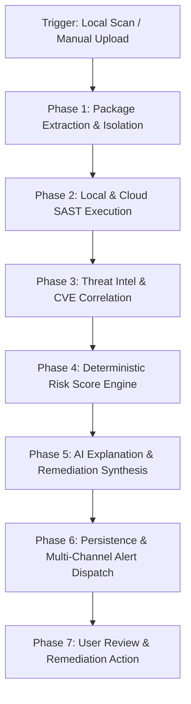
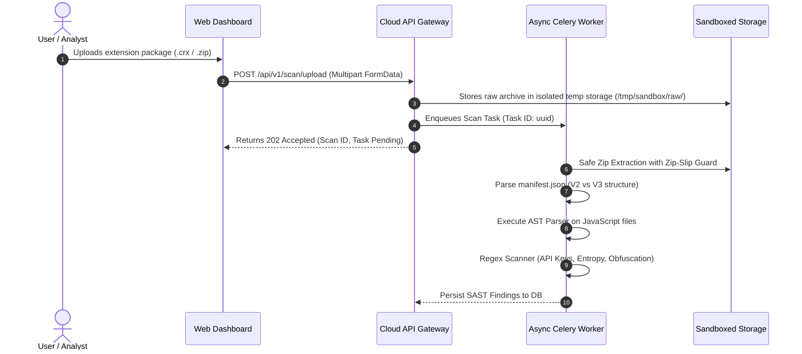

# Business & Domain Workflows — Antigraviiti Extension Protect (AEP)

---

## 1. Enterprise Business Workflow Overview

**Antigraviiti Extension Protect (AEP)** enforces an end-to-end security pipeline that automatically transforms raw browser extension assets into actionable threat intelligence, normalized risk scores, and AI-driven mitigation recommendations.

---

## 2. Core Business Processes

### 2.1 Process 1: Desktop Extension Discovery & Ingestion

**Objective**: Automatically audit all browser extensions installed on a endpoint without requiring manual user intervention or manual CRX exporting.

#### Workflow Steps
1. **Local Schedule / File System Watcher Trigger**: The Desktop Agent's background service triggers an automated scan on a schedule (e.g., daily) or whenever a browser extension directory modification event is detected.
2. **Directory Traversal**: The Desktop Agent enumerates extension directories across Chrome, Edge, Brave, and Opera profiles.
3. **Manifest Inspection**: For each extension directory, the Agent reads `manifest.json`, extracts `extension_id`, `version`, `name`, `permissions`, `host_permissions`, `content_scripts`, and `background`.
4. **Asset Hashing**: The Agent calculates SHA-256 cryptographic hashes for all `.js`, `.json`, `.html`, and binary assets within the extension package.
5. **PII Sanitization**: The Agent strips local user profile names (e.g., `C:\Users\JohnDoe\...` is anonymized to `<USER_PROFILE>\...`).
6. **Telemetry Transmission**: The Agent constructs an encrypted payload and emits it to `POST /api/v1/agent/sync`.

---

### 2.2 Process 2: Extension Package Extraction & SAST Pipeline

**Objective**: Safely unpack and statically analyze `.crx` or `.zip` file packages uploaded via the Web Dashboard or API.

#### Extraction Security Business Rules
- **Zip-Slip Guard**: Extraction target paths are validated to ensure `canonical_path.starts_with(sandbox_dir)`. Any violation immediately aborts extraction and logs a `CRITICAL_SECURITY_EVENT`.
- **Archive Size & Decompression Ratio Limit**: Maximum archive size is capped at 50 MB uncompressed. Maximum decompression ratio is 100:1 (protecting against Zip Bomb attacks).

---

### 2.3 Process 3: Enriched Threat Intelligence & Risk Score Engine

**Objective**: Evaluate static analysis findings against Threat Intelligence feeds, CVE databases, and compute a deterministic Risk Score.

#### Business Rules & Scoring Calculation
1. **Permission Risk Matrix Calculation**:
   - Permission `<all_urls>` or `*://*/*`: $+30.0$ points.
   - Permission `webRequest` or `declarativeNetRequest`: $+20.0$ points.
   - Permission `cookies` or `privacy`: $+15.0$ points.
   - Permission `management` or `debugger`: $+25.0$ points.
2. **AST Anomaly Scoring**:
   - Usage of `eval()` or `Function()` constructor: $+20.0$ points.
   - Usage of `atob()` with dynamic script creation: $+15.0$ points.
   - High entropy / string array obfuscation detected: $+25.0$ points.
3. **Hardcoded Secrets & Telemetry**:
   - High-entropy API key pattern match (AWS, Stripe, OpenAI, Google): $+30.0$ points.
   - Communication to unvetted external IP or suspicious TLD: $+20.0$ points.
4. **Threat Intelligence & CVE Matching**:
   - Matching known malicious SHA-256 hash in VirusTotal / Threat DB: Sets Risk Score directly to **100.0 (Critical)**.
   - Unpatched CVE vulnerability in third-party library: $+15.0$ points per CVE.

$$\text{Final Risk Score} = \min\left(100.0, \sum \text{Weights}\right)$$

---

### 2.4 Process 4: AI Explanation & Remediation Synthesis

**Objective**: Translate raw technical SAST outputs into clear human-readable narratives and actionable security guidance.

#### AI Processing Rules
- **Input Data**: The AI service receives a sanitized JSON object containing:
  - Extension Name, Version, Manifest Version
  - Calculated Risk Score & Risk Category
  - List of detected AST findings (line numbers, snippet snippets)
  - List of broad permissions requested
  - Hardcoded domains/secrets summary
- **Prompt Isolation**: Standard system prompts enforce zero PII leakage, prohibiting the model from fabricating non-existent vulnerabilities (hallucination defense).
- **Output Schema**: Structured JSON returning:
  - `executive_summary`: 2-paragraph overview for non-technical users.
  - `technical_findings_explanation`: Itemized breakdown of risk factors.
  - `remediation_recommendations`: Clear action steps (e.g., "Remove Extension", "Revoke Host Permissions", "Safe to Keep").

---

### 2.5 Process 5: Multi-Channel Alerting & Notification

**Objective**: Immediately inform the user or SOC team when high-risk extensions are detected.

#### Notification Triggers
- **Risk Score $\ge 70.0$ (High / Critical Risk)**:
  - Desktop Agent fires an OS-level notification balloon.
  - Chrome Companion Extension updates toolbar badge to 🔴 **Red**.
  - Web Dashboard pushes real-time WebSocket alert.
  - Email / Webhook notification dispatched to Enterprise SOC channel.
