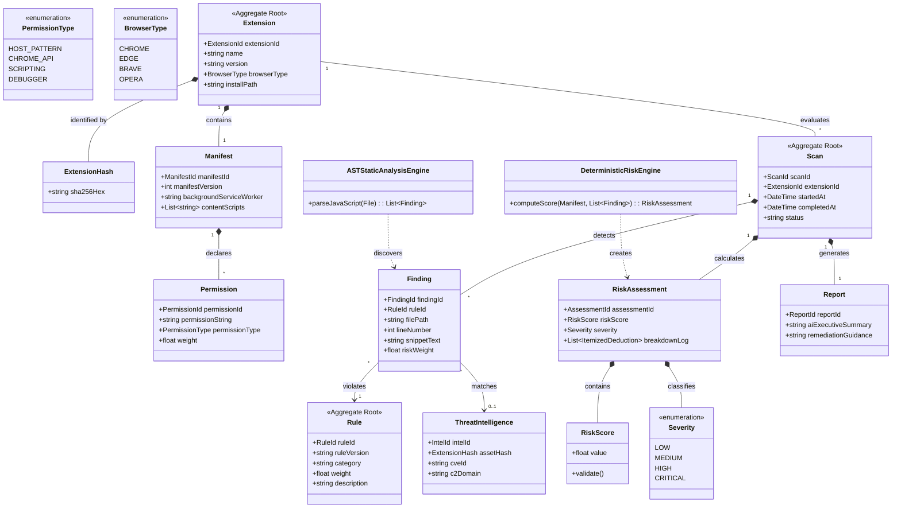

# Domain Model Specification — Antigraviiti Extension Protect (AEP)

---

## 1. Document Information

| Metadata Field | Document Detail |
| :--- | :--- |
| **Document Title** | AEP Authoritative Domain Model Specification (Domain-Driven Design) |
| **Document ID** | `DOC-DOM-001` |
| **Current Status** | DRAFT — Pending CTO Review |
| **Document Version** | `1.0.0` |
| **Document Owner** | Lead Software Architect & Systems Analyst |
| **Technical Reviewer** | Chief Technology Officer (CTO) / Security Architect |
| **Last Updated** | 2026-08-04 |
| **Target Audience** | Software Architects, Domain Engineers, Backend Developers, and Database Designers |
| **Source References** | [`docs/PROJECT_PRINCIPLES.md`](file:///d:/ExtensionProtect/docs/PROJECT_PRINCIPLES.md), [`docs/ENGINEERING_PRINCIPLES.md`](file:///d:/ExtensionProtect/docs/ENGINEERING_PRINCIPLES.md), [`docs/PRODUCT_REQUIREMENTS.md`](file:///d:/ExtensionProtect/docs/PRODUCT_REQUIREMENTS.md), [`docs/FEATURE_CATALOG.md`](file:///d:/ExtensionProtect/docs/FEATURE_CATALOG.md), [`docs/USE_CASE.md`](file:///d:/ExtensionProtect/docs/USE_CASE.md), [`docs/adr/ADR-001_OFFLINE_FIRST_ARCHITECTURE.md`](file:///d:/ExtensionProtect/docs/adr/ADR-001_OFFLINE_FIRST_ARCHITECTURE.md) |

---

## 2. Strategic Bounded Contexts & Domain Architecture

Using **Domain-Driven Design (DDD)** principles, the **Antigraviiti Extension Protect (AEP)** system is partitioned into one **Core Domain** and five **Supporting Sub-Domains**.

```
+-----------------------------------------------------------------------------------+
|                        ANTIGRAVIITI EXTENSION PROTECT (AEP)                       |
|                             BOUNDED CONTEXT MAP                                   |
+-----------------------------------------------------------------------------------+
|                                                                                   |
|  CORE DOMAIN                                                                      |
|  +-----------------------------------------------------------------------------+  |
|  |             EXTENSION SECURITY & RISK ASSESSMENT DOMAIN                     |  |
|  |   - Deterministic Risk Engine | Manifest & AST SAST Analysis                |  |
|  +-----------------------------------------------------------------------------+  |
|                                                                                   |
|  SUPPORTING SUB-DOMAINS                                                           |
|  +---------------------------+  +---------------------------+                     |
|  | SCANNER & INGESTION       |  | THREAT INTEL & CVE        |                     |
|  | - Package Unpacking       |  | - SHA256 Hash Matching    |                     |
|  | - Profile Auto-Discovery  |  | - Vulnerable JS Libraries |                     |
|  +---------------------------+  +---------------------------+                     |
|  +---------------------------+  +---------------------------+  +----------------+ |
|  | REPORTING & AI EXPLANATION|  | NOTIFICATION & ALERTING   |  | PRIVACY & CONFIG| |
|  | - Itemized Score Logs     |  | - Local OS Desktop Banners|  | - Data Scrub   | |
|  | - Plain AI Narrative      |  | - SIEM Telemetry Alerts   |  | - Offline Sync | |
|  +---------------------------+  +---------------------------+  +----------------+ |
|                                                                                   |
+-----------------------------------------------------------------------------------+
```

### 2.1 Core Domain: Extension Security & Risk Assessment
- **Role**: The primary business differentiator of AEP.
- **Responsibilities**: Performs static manifest inspection, JavaScript Abstract Syntax Tree (AST) code analysis, host/API permission severity evaluation, and deterministic mathematical Risk Score ($0.0 - 100.0$) calculation.
- **Business Value**: Eliminates black-box safety metrics by producing 100% reproducible, mathematically transparent, and auditable risk evaluations for any Chromium browser extension.

### 2.2 Supporting Sub-Domains
1. **Scanner & Package Ingestion Sub-Domain**: Discovers installed extension profiles locally across browsers (Chrome, Edge, Brave, Opera) and extracts uploaded package archives (`.crx` / `.zip`) inside sandboxed extraction environments.
2. **Threat Intelligence & CVE Sub-Domain**: Manages asset cryptographic hashes (`SHA-256`), maps embedded third-party JavaScript libraries to NVD CVE records, and identifies C2 domain infrastructure.
3. **Reporting & AI Explanation Sub-Domain**: Compiles itemized score deduction logs, translates raw SAST findings into plain-language AI narratives, and renders executive compliance reports.
4. **Notification & Alerting Sub-Domain**: Monitors endpoint risk state changes and dispatches native OS desktop notifications or enterprise SIEM alerts when extensions exceed risk thresholds ($\ge 70.0$).
5. **Privacy & Configuration Sub-Domain**: Enforces local-first data isolation, sanitizes user PII from file paths, and manages offline-first configuration state.

---

## 3. Domain Entities & Lifecycles

Entities possess a distinct identity that persists over time, independent of their attributes.

```
+-----------------------------------------------------------------------------------+
|                              CORE DOMAIN ENTITIES                                 |
+-----------------------------------------------------------------------------------+
| 1. Extension          | 2. Scan                  | 3. Manifest                    |
| 4. Permission         | 5. Finding               | 6. RiskAssessment              |
| 7. Rule               | 8. ThreatIntelligence    | 9. Report                      |
+-----------------------------------------------------------------------------------+
```

### 3.1 Entity 1: `Extension`
- **Purpose**: Represents a unique browser extension installed on an endpoint or uploaded as a standalone build package.
- **Identity**: `ExtensionId` (Natural Key: Browser Extension ID string, e.g. `nkbihfbeogaeaoehlefnkodbefgpgknn`).
- **Responsibilities**: Maintains extension identity, name, version, author metadata, browser distribution type, and installation directory paths.
- **Relationships**: Has one `Manifest`; has many `Scans`.
- **Lifecycle State Machine**: `DISCOVERED` $\rightarrow$ `ANALYZED` $\rightarrow$ `MONITORED` (or `REMOVED`).

### 3.2 Entity 2: `Scan`
- **Purpose**: Represents a single execution instance of static analysis performed against an `Extension`.
- **Identity**: `ScanId` (UUID v4).
- **Responsibilities**: Tracks scan execution state, trigger source (Automated / Manual Upload / Scheduled), scan timestamps, execution duration, and sandbox extraction paths.
- **Relationships**: Belongs to `Extension`; has one `RiskAssessment`; has many `Findings`.
- **Lifecycle State Machine**: `INITIATED` $\rightarrow$ `UNPACKING` $\rightarrow$ `PARSING` $\rightarrow$ `SCORING` $\rightarrow$ `COMPLETED` (or `FAILED`).

### 3.3 Entity 3: `Manifest`
- **Purpose**: Represents the parsed configuration metadata derived from an extension's `manifest.json` asset.
- **Identity**: `ManifestId` (UUID v4).
- **Responsibilities**: Captures manifest format version (V2 vs V3), background service worker scripts, background pages, content script match patterns, and web-accessible resources.
- **Relationships**: Belongs to `Extension`; has many `Permissions`.
- **Lifecycle**: Created during package parsing phase; immutable once created.

### 3.4 Entity 4: `Permission`
- **Purpose**: Represents a single requested permission declared within the extension manifest.
- **Identity**: `PermissionId` (UUID v4).
- **Responsibilities**: Stores the permission string, categorizes permission type (Host Pattern / Chrome API / Scripting), and assigns standard permission risk weights ($w_p$).
- **Relationships**: Belongs to `Manifest`.
- **Lifecycle**: Instantiated during manifest parsing; immutable value representation.

### 3.5 Entity 5: `Finding`
- **Purpose**: Represents an individual security anomaly or policy violation discovered during AST code analysis or manifest inspection.
- **Identity**: `FindingId` (UUID v4).
- **Responsibilities**: Pinpoints file name, line number, code snippet, rule category, risk weight, and threat explanation.
- **Relationships**: Belongs to `Scan`; references one `Rule`.
- **Lifecycle**: Generated during SAST AST parsing phase; immutable once attached to a `Scan`.

### 3.6 Entity 6: `RiskAssessment`
- **Purpose**: Captures the final deterministic risk score evaluation for a completed `Scan`.
- **Identity**: `AssessmentId` (UUID v4).
- **Responsibilities**: Computes total numerical Risk Score ($0.0 - 100.0$), assigns Risk Category (LOW, MEDIUM, HIGH, CRITICAL), and compiles itemized point deduction logs.
- **Relationships**: Belongs to `Scan`; contains `RiskScore` Value Object.
- **Lifecycle**: Computed at conclusion of scan pipeline; immutable historic record.

### 3.7 Entity 7: `Rule`
- **Purpose**: Defines a single static analysis detection heuristic or permission evaluation criteria within the Rule Engine.
- **Identity**: `RuleId` (Standardized String Key, e.g. `SAST-JS-EVAL-001`).
- **Responsibilities**: Maintains rule criteria, severity category, point weight ($w$), description, and rule semantic version (`rule_version`).
- **Relationships**: Referenced by many `Findings`.
- **Lifecycle State Machine**: `ACTIVE` $\rightarrow$ `DEPRECATED` (or `UPDATED`).

### 3.8 Entity 8: `ThreatIntelligence`
- **Purpose**: Represents external threat intelligence correlation records (SHA-256 malware matches, C2 domains, CVE records).
- **Identity**: `IntelId` (UUID v4).
- **Responsibilities**: Stores cryptographic asset hashes, C2 IP/domain blocklists, and NVD CVE library vulnerability references.
- **Relationships**: Attached to `Finding` or `Extension`.
- **Lifecycle**: Synchronized asynchronously from threat intelligence feeds.

### 3.9 Entity 9: `Report`
- **Purpose**: Represents a human-readable or machine-readable compliance report compiled from a `Scan` and `RiskAssessment`.
- **Identity**: `ReportId` (UUID v4).
- **Responsibilities**: Encapsulates qualitative AI narrative summaries, executive charts, and remediation guidelines for export (JSON / PDF).
- **Relationships**: Belongs to `Scan`.
- **Lifecycle**: Generated on demand or upon scan completion.

---

## 4. Immutable Value Objects

Value Objects possess no conceptual identity; they are defined entirely by their attribute values and are strictly immutable.

```
+-----------------------------------------------------------------------------------+
|                              IMMUTABLE VALUE OBJECTS                              |
+-----------------------------------------------------------------------------------+
|  1. RiskScore       : Normalized float (0.0 - 100.0)                              |
|  2. Severity        : Enum (LOW | MEDIUM | HIGH | CRITICAL)                       |
|  3. PermissionType  : Enum (HOST_PATTERN | CHROME_API | SCRIPTING | DEBUGGER)     |
|  4. BrowserType     : Enum (CHROME | EDGE | BRAVE | OPERA)                        |
|  5. ExtensionHash   : Immutable String (64-char SHA-256 Hex)                     |
|  6. RuleVersion     : Semantic Versioning String (e.g. "1.2.0")                   |
|  7. CodeSnippet     : File path, Line Number, and Source Context tuple              |
+-----------------------------------------------------------------------------------+
```

### 4.1 Value Object Definitions
- **`RiskScore`**: Encapsulates a float bounded strictly between $0.0$ and $100.0$. Validates bounds upon instantiation; immutable.
- **`Severity`**: Categorical enum representing threat impact: `LOW`, `MEDIUM`, `HIGH`, `CRITICAL`.
- **`PermissionType`**: Enum categorizing permission behavior: `HOST_PATTERN` (e.g. `<all_urls>`), `CHROME_API` (e.g. `cookies`), `SCRIPTING`, `DEBUGGER`.
- **`BrowserType`**: Enum identifying Chromium host browser: `CHROME`, `EDGE`, `BRAVE`, `OPERA`.
- **`ExtensionHash`**: Value object encapsulating a verified 64-character hexadecimal SHA-256 string representing cryptographic file integrity.
- **`RuleVersion`**: Value object enforcing semantic versioning (`MAJOR.MINOR.PATCH`) for Rule Engine updates.
- **`CodeSnippet`**: Tuple containing `filePath`, `lineNumber`, `columnNumber`, and `snippetText` representing exact SAST AST findings.

---

## 5. Domain Aggregates & Aggregate Roots

Aggregates define consistency boundaries around one or more Entities and Value Objects. All external access to an Aggregate MUST pass through its designated **Aggregate Root**.

```
+-----------------------------------------------------------------------------------+
|                             DOMAIN AGGREGATES MATRIX                              |
+-----------------------------------------------------------------------------------+
| 1. ExtensionAggregate   : Root = Extension (Encapsulates Manifest & Permissions)  |
| 2. ScanResultAggregate  : Root = Scan (Encapsulates Findings, Assessment & Report)|
| 3. RuleSetAggregate     : Root = Rule (Encapsulates Heuristics & Weights)         |
+-----------------------------------------------------------------------------------+
```

### 5.1 Aggregate 1: `ExtensionAggregate`
- **Aggregate Root**: `Extension` Entity.
- **Encapsulated Members**: `Manifest` Entity, `Permission` Entities, `ExtensionHash` Value Objects.
- **Boundary Justification**: Enforces structural consistency between an extension's declared identity, manifest structure, and permissions. An extension cannot modify permissions without re-parsing its manifest.

### 5.2 Aggregate 2: `ScanResultAggregate`
- **Aggregate Root**: `Scan` Entity.
- **Encapsulated Members**: `RiskAssessment` Entity, `Finding` Entities, `Report` Entity, `RiskScore` Value Object, `CodeSnippet` Value Objects.
- **Boundary Justification**: Enforces invariant rule that a `RiskAssessment` and its `Findings` belong strictly to a single `Scan` execution. Modifying a finding automatically updates the aggregate's score calculation.

### 5.3 Aggregate 3: `RuleSetAggregate`
- **Aggregate Root**: `Rule` Entity.
- **Encapsulated Members**: `RuleVersion` Value Object, rule weight coefficients ($w$).
- **Boundary Justification**: Guarantees that rule definitions and scoring weights remain version-controlled and atomic during scan executions.

---

## 6. Business Domain Services

Domain Services encapsulate business operations and algorithms that do not naturally belong to a single Entity or Value Object.

```
+-----------------------------------------------------------------------------------+
|                                DOMAIN SERVICES                                    |
+-----------------------------------------------------------------------------------+
| 1. ScanOrchestrationService   : Manages extraction & scan execution pipeline      |
| 2. DeterministicRiskEngine    : Computes mathematical risk scores (0.0 - 100.0)   |
| 3. ASTStaticAnalysisEngine    : Executes AST parsing & dynamic code detection     |
| 4. ThreatMatchingService      : Cross-references asset hashes & CVE databases     |
| 5. AINarrativeSynthesizer     : Generates qualitative plain-language explanations  |
+-----------------------------------------------------------------------------------+
```

### 6.1 Service 1: `ScanOrchestrationService`
- **Responsibilities**: Orchestrates the multi-stage scanning lifecycle: (1) Local profile discovery, (2) Sandboxed package extraction with Zip-Slip validation, (3) Invoking static analysis engines, and (4) Triggering score calculations.

### 6.2 Service 2: `DeterministicRiskEngine`
- **Responsibilities**: Executes the mathematical scoring algorithm:
  $$\text{Risk Score} = \min\left(100.0, \sum w_p \cdot P_i + \sum w_a \cdot A_j + \sum w_n \cdot N_k + w_{cve} \cdot C\right)$$
  Computes itemized point deduction logs and guarantees 100% score reproducibility ([`PROJECT_PRINCIPLES.md`, Principle 10](file:///d:/ExtensionProtect/docs/PROJECT_PRINCIPLES.md#principle-10-explainable--deterministic-risk-scoring-risk-score-harus-deterministik--transparan)).

### 6.3 Service 3: `ASTStaticAnalysisEngine`
- **Responsibilities**: Parses JavaScript files into Abstract Syntax Trees, detecting dynamic execution (`eval()`, `Function()`), obfuscation decoders (`atob()`), hardcoded secrets (AWS, Stripe), and DOM scraping sinks.

### 6.4 Service 4: `ThreatMatchingService`
- **Responsibilities**: Queries cached local/cloud threat intelligence databases to match asset cryptographic hashes (`SHA-256`) and cross-reference embedded JS library versions against NVD CVE records.

### 6.5 Service 5: `AINarrativeSynthesizer`
- **Responsibilities**: Translates raw `Finding` logs and `RiskAssessment` objects into plain-language qualitative summaries using LLMs (OpenAI / Ollama), enforcing strict anti-hallucination guardrails ([`PROJECT_PRINCIPLES.md`, Principle 12](file:///d:/ExtensionProtect/docs/PROJECT_PRINCIPLES.md#principle-12-ai-as-an-explainer-never-a-score-determinant-ai-sebagai-penjelas-bukan-penentu-score)).

---

## 7. Domain Events

Domain Events represent significant business occurrences within the domain lifecycle, enabling decoupled, event-driven communication.

| Domain Event Name | Trigger Condition | Event Payload Data | Business Reaction / Subscriber |
| :--- | :--- | :--- | :--- |
| **`ExtensionDiscovered`** | Desktop Agent detects a new extension installed in a local browser profile. | `ExtensionId`, `BrowserType`, `Path` | Triggers automated background scan pipeline. |
| **`ScanStarted`** | `ScanOrchestrationService` initiates a new scan task. | `ScanId`, `ExtensionId`, `Timestamp` | Updates UI state & initializes temporary sandbox. |
| **`ASTFindingDetected`** | AST SAST engine identifies a dangerous code anomaly (`eval`, secret). | `ScanId`, `RuleId`, `CodeSnippet`, `Weight` | Appends finding to active `ScanResultAggregate`. |
| **`ScanCompleted`** | Deterministic Risk Engine completes score calculation and itemized breakdown. | `ScanId`, `RiskScore`, `Severity` | Persists report to SQLite; triggers AI narrative synthesis. |
| **`HighRiskDetected`** | Completed scan yields a Risk Score $\ge 70.0$ (High Risk). | `ExtensionId`, `RiskScore`, `Severity` | Fires local OS desktop banner notification (`UC-NOTIF-01`). |
| **`ThreatIntelMatchFound`**| Asset SHA-256 hash matches known malware DB or CVE record. | `ExtensionId`, `AssetHash`, `CVE_ID` | Overrides Risk Score to $100.0$ (Critical Risk). |
| **`RuleSetUpdated`** | Desktop Agent receives updated security rules from Cloud sync worker. | `RuleVersion`, `UpdatedRuleCount` | Re-evaluates local extension posture against new rules. |

---

## 8. Mermaid Domain Architecture Diagram



---

## 9. Domain Evolution & Multi-Release Roadmap Alignment

The Domain Model is structured to support seamless expansion across all release phases without breaking core domain abstractions:

```
Version 1.0 (MVP) ──> Version 2.0 (Cloud) ──> Version 3.0 (Companion) ──> Version 5.0 (Enterprise)
 (Core SAST Entities) (ThreatIntel & CVEs)  (Local IPC Sync)        (Enterprise Fleet Aggregate)
```

- **Version 1.0 MVP Core**: Implements `ExtensionAggregate`, `ScanResultAggregate`, `RuleSetAggregate`, `ASTStaticAnalysisEngine`, and `DeterministicRiskEngine` fully offline on the Desktop Agent.
- **Version 2.0 (Cloud Intelligence)**: Expands `ThreatIntelligence` entity and integrates `ThreatMatchingService` for asynchronous CVE and hash matching.
- **Version 3.0 (Chrome Companion)**: Connects toolbar badge states directly to `RiskAssessment` severity status via local IPC.
- **Version 5.0 (Enterprise Fleet Governance)**: Introduces the `EnterpriseFleetAggregate` (grouping thousands of `ExtensionAggregate` and `ScanResultAggregate` instances across employee endpoints for CISO policy enforcement).

---

## 10. Related Architecture & Design Documents

- [`docs/PROJECT_PRINCIPLES.md`](file:///d:/ExtensionProtect/docs/PROJECT_PRINCIPLES.md) — Constitutional Principles
- [`docs/ENGINEERING_PRINCIPLES.md`](file:///d:/ExtensionProtect/docs/ENGINEERING_PRINCIPLES.md) — Engineering Handbook & Clean Architecture Rules
- [`docs/PRODUCT_REQUIREMENTS.md`](file:///d:/ExtensionProtect/docs/PRODUCT_REQUIREMENTS.md) — Product Requirements Specification (PRD)
- [`docs/FEATURE_CATALOG.md`](file:///d:/ExtensionProtect/docs/FEATURE_CATALOG.md) — Product Feature Catalog
- [`docs/USE_CASE.md`](file:///d:/ExtensionProtect/docs/USE_CASE.md) — Use Case Specifications
- [`docs/adr/ADR-001_OFFLINE_FIRST_ARCHITECTURE.md`](file:///d:/ExtensionProtect/docs/adr/ADR-001_OFFLINE_FIRST_ARCHITECTURE.md) — Offline-First Architecture ADR
- [`docs/README.md`](file:///d:/ExtensionProtect/docs/README.md) — Master Documentation Index
