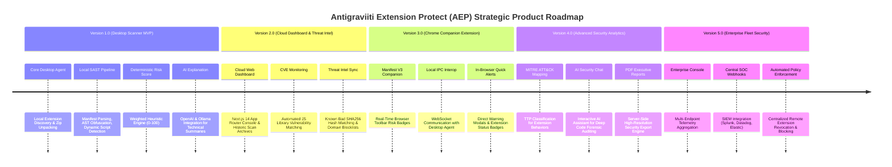

# Complete Feature Matrix & Version Roadmap — Antigraviiti Extension Protect (AEP)

---

## 1. Feature Matrix Specification (MVP vs Future Versions)

The **Antigraviiti Extension Protect (AEP)** platform is structured into clear functional releases. All MVP capabilities are mandatory for the initial platform deployment.

| Feature ID | Feature Name | Core Description | Release Target |
| :--- | :--- | :--- | :--- |
| **FEAT-MVP-01** | **Installed Extension Scanner** | Automatic discovery of installed extensions across Chrome, Edge, Brave, and Opera via Desktop Agent. | **Version 1.0 (MVP)** |
| **FEAT-MVP-02** | **Manifest Analyzer** | Deep parsing of `manifest.json` V2 and V3 structure, metadata, background pages, and service workers. | **Version 1.0 (MVP)** |
| **FEAT-MVP-03** | **Permission Risk Analyzer** | Weighted risk evaluation of standard permissions (`cookies`, `webRequest`, `tabs`, `management`, `debugger`). | **Version 1.0 (MVP)** |
| **FEAT-MVP-04** | **Host Permission Analyzer** | Pattern evaluation of host permissions (`<all_urls>`, `*://*/*`, wildcard subdomains). | **Version 1.0 (MVP)** |
| **FEAT-MVP-05** | **Content Script Inspector** | Risk scoring of DOM injection scripts, injected matches, and execution run_at timings. | **Version 1.0 (MVP)** |
| **FEAT-MVP-06** | **Background Script Inspector** | Static analysis of persistent background pages and Manifest V3 background service workers. | **Version 1.0 (MVP)** |
| **FEAT-MVP-07** | **Web Accessible Resources Scanner**| Identification of exposed internal extension assets accessible by arbitrary external webpages. | **Version 1.0 (MVP)** |
| **FEAT-MVP-08** | **Dangerous Chrome API Inspector** | AST detection of sensitive Chrome APIs (`chrome.tabs.executeScript`, `chrome.cookies.get`, `chrome.debugger`). | **Version 1.0 (MVP)** |
| **FEAT-MVP-09** | **External Domain Communication** | Regex and AST discovery of external hardcoded C2 IPs, HTTP endpoints, and WebSockets. | **Version 1.0 (MVP)** |
| **FEAT-MVP-10** | **Hardcoded Secrets & API Key SAST** | Entropy calculation and pattern matching for AWS, Stripe, OpenAI, and Webhook credentials. | **Version 1.0 (MVP)** |
| **FEAT-MVP-11** | **Obfuscation Detection Engine** | AST heuristics for high entropy, heavy string encodings, variable renaming, and array decoders. | **Version 1.0 (MVP)** |
| **FEAT-MVP-12** | **Eval & Dynamic Script Detection** | AST detection of `eval()`, `Function()`, `setTimeout(string)`, and dynamic script element creation. | **Version 1.0 (MVP)** |
| **FEAT-MVP-13** | **Atob Base64 Code Decoder** | Detection and payload decoding of base64 encoded strings (`atob()`) passed to dynamic execution. | **Version 1.0 (MVP)** |
| **FEAT-MVP-14** | **Content Security Policy (CSP) Audit**| Parsing extension CSP headers for dangerous directives (`unsafe-eval`, `unsafe-inline`, HTTP sources). | **Version 1.0 (MVP)** |
| **FEAT-MVP-15** | **Deterministic Risk Score Engine** | Mathematical risk calculation ($0.0 - 100.0$) using weighted rules (No AI scoring dependencies). | **Version 1.0 (MVP)** |
| **FEAT-MVP-16** | **AI Security Summary Engine** | AI-driven qualitative synthesis of technical findings, risk explanations, and threat context. | **Version 1.0 (MVP)** |
| **FEAT-MVP-17** | **Security Recommendations Engine**| Actionable mitigation guidance for users, developers, and security analysts. | **Version 1.0 (MVP)** |
| **FEAT-MVP-18** | **Local OS Notification System** | Desktop Agent OS popups alerting users upon detection of high-risk installed extensions. | **Version 1.0 (MVP)** |
| **FEAT-ROAD-01** | **CVE Vulnerability Monitoring** | Automated cross-referencing of third-party JS libraries (jQuery, Lodash) against NVD CVE DB. | **Version 2.0 (Cloud)** |
| **FEAT-ROAD-02** | **Threat Intelligence Integration** | VirusTotal hash lookup, known malicious extension C2 domain blocklists. | **Version 2.0 (Cloud)** |
| **FEAT-ROAD-03** | **Chrome Companion Extension** | In-browser Manifest V3 extension displaying risk badges and bridging to Desktop Agent. | **Version 3.0 (Companion)**|
| **FEAT-ROAD-04** | **MITRE ATT&CK Mapping** | Mapping extension behaviors to MITRE ATT&CK techniques (T1114 Data Exfiltration, T1056 Keylogging). | **Version 4.0 (Intel)** |
| **FEAT-ROAD-05** | **Enterprise Fleet Monitoring** | Enterprise admin panel monitoring installed extension inventory across company laptop fleets. | **Version 5.0 (Enterprise)**|

---

## 2. Version Roadmap (Version 1.0 through Version 5.0)

---

## 3. Product Release Milestones Summary

### Version 1.0: Desktop Scanner (MVP)
Focuses on local endpoint security. The Desktop Agent scans installed browser extension directories, performs local AST parsing, transmits anonymized metadata to the Cloud API, computes the deterministic Risk Score, and triggers local OS notifications when high-risk extensions are detected.

### Version 2.0: Cloud Dashboard & Threat Intelligence
Introduces the central Web Dashboard (Next.js 14) and enriches scans with Threat Intelligence. Features automated CVE lookup for embedded JavaScript libraries and hash reputation matching against known malware databases.

### Version 3.0: Chrome Companion Extension
Delivers an in-browser Manifest V3 companion extension. Users receive visual risk badge indicators (Green/Yellow/Red) directly on their browser toolbar and can trigger instant local scans via local WebSocket interop.

### Version 4.0: Advanced Security Analytics
Enriches forensics with MITRE ATT&CK matrix mapping, an interactive AI security assistant for deep code line inspection, and server-side PDF executive report generation.

### Version 5.0: Enterprise Fleet Security
Scales AEP to enterprise SOC teams, enabling central monitoring of thousands of employee endpoints, SIEM integration, and centralized policy enforcement.
