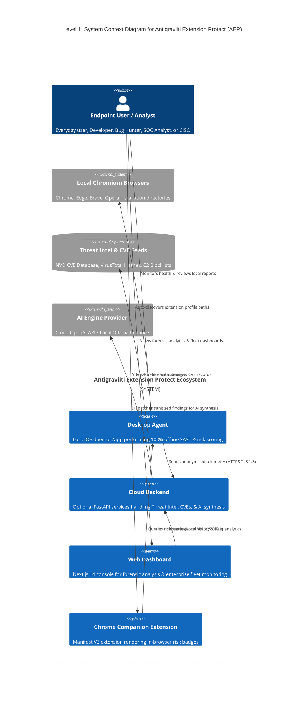
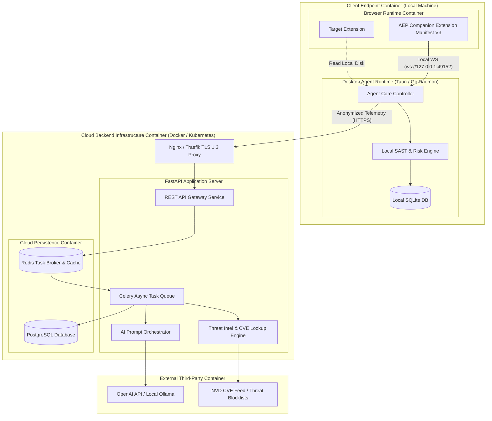
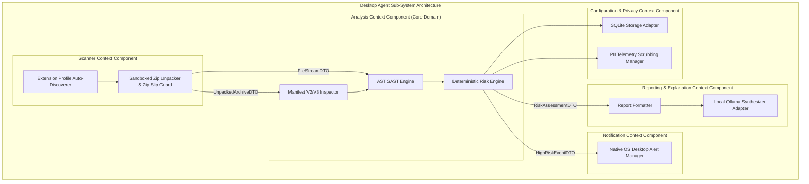

# Master System Architecture Blueprint — Antigraviiti Extension Protect (AEP)

---

## 1. Document Information

| Metadata Field | Document Detail |
| :--- | :--- |
| **Document Title** | AEP Master System Architecture Blueprint |
| **Document ID** | `DOC-ARCH-001` |
| **Current Status** | FINAL — Approved Master Architecture Blueprint |
| **Document Version** | `2.0.0` |
| **Document Owner** | Lead Software Architect |
| **Technical Reviewer** | Chief Technology Officer (CTO) / Security Architect |
| **Last Updated** | 2026-08-04 |
| **Target Audience** | Software Architects, Engineering Leads, Backend Developers, Desktop Engineers, and Security Auditors |
| **Source References** | [`docs/PROJECT_PRINCIPLES.md`](file:///d:/ExtensionProtect/docs/PROJECT_PRINCIPLES.md), [`docs/ENGINEERING_PRINCIPLES.md`](file:///d:/ExtensionProtect/docs/ENGINEERING_PRINCIPLES.md), [`docs/PRODUCT_VISION.md`](file:///d:/ExtensionProtect/docs/PRODUCT_VISION.md), [`docs/PRODUCT_REQUIREMENTS.md`](file:///d:/ExtensionProtect/docs/PRODUCT_REQUIREMENTS.md), [`docs/FEATURE_CATALOG.md`](file:///d:/ExtensionProtect/docs/FEATURE_CATALOG.md), [`docs/USE_CASE.md`](file:///d:/ExtensionProtect/docs/USE_CASE.md), [`docs/adr/ADR-001_OFFLINE_FIRST_ARCHITECTURE.md`](file:///d:/ExtensionProtect/docs/adr/ADR-001_OFFLINE_FIRST_ARCHITECTURE.md), [`docs/DOMAIN_MODEL.md`](file:///d:/ExtensionProtect/docs/DOMAIN_MODEL.md), [`docs/BOUNDED_CONTEXT.md`](file:///d:/ExtensionProtect/docs/BOUNDED_CONTEXT.md) |

---

## 2. Executive Architectural Overview & Core Paradigm

**Antigraviiti Extension Protect (AEP)** is an enterprise-grade, AI-powered browser extension security platform engineered around an **Offline-First, Privacy-by-Default Desktop Architecture**.

Unlike legacy web upload utilities, AEP establishes the **Desktop Agent** as the primary, self-contained operational core. The local Desktop Agent performs automatic extension discovery, sandboxed package extraction, static manifest parsing, Abstract Syntax Tree (AST) code analysis, deterministic mathematical risk scoring ($0.0 - 100.0$), local SQLite scan history persistence, and native OS desktop alerts fully offline without requiring cloud connectivity.

The **Cloud Backend** operates strictly as an optional, non-blocking enrichment layer providing global threat intelligence hash cross-referencing (`SHA-256`), CVE database lookups, AI qualitative narrative synthesis, web dashboard analytics, and enterprise fleet governance.

```
+-----------------------------------------------------------------------------------+
|                         AEP SYSTEM PIPELINE ARCHITECTURE                          |
+-----------------------------------------------------------------------------------+
|                                                                                   |
|  [ LOCAL ENDPOINT DAEMON (DESKTOP AGENT CORE - 100% OFFLINE) ]                    |
|    Browser Profile Discovery ──> Sandboxed Zip Unpacking ──> Manifest & AST SAST  |
|    ──> Deterministic Risk Engine ──> Local SQLite Storage ──> Local OS Alerts     |
|                                                                                   |
|  -------------------------------------------------------------------------------  |
|                                                                                   |
|  [ OPTIONAL CLOUD BACKEND & ECOSYSTEM (ASYNC ENRICHMENT) ]                        |
|    Threat Intel Hashes (SHA-256) ──> CVE DB ──> AI Narrative Synthesizer          |
|    ──> Web Dashboard ──> Chrome Companion Extension (Toolbar Badge IPC)           |
|                                                                                   |
+-----------------------------------------------------------------------------------+
```

---

## 3. Master Pipeline Architecture Diagram

The Mermaid diagram below details the operational end-to-end processing pipeline, tracing interactions across local bounded contexts, the Cloud Backend, Web Dashboard, and Chrome Companion Extension:

```mermaid
graph TB
    subgraph "CLIENT ENDPOINT (DESKTOP AGENT CORE - 100% OFFLINE)"
        subgraph "Scanner Context"
            DISC[Extension Discoverer]
            UNPACK[Sandboxed Zip Unpacker]
        end
        
        subgraph "Analysis Context (Core Domain)"
            PARSER[Manifest & Structure Inspector]
            SAST[AST SAST Engine]
            RISK_ENG[Deterministic Risk Engine]
        end
        
        subgraph "Reporting & Explanation Context"
            REPORT_GEN[Report Generator]
            LOCAL_AI[Local Ollama Synthesizer]
        end
        
        subgraph "Notification Context"
            OS_ALERT[Local OS Desktop Banners]
        end
        
        subgraph "Configuration & Privacy Context"
            LOCAL_DB[(Local SQLite Storage)]
            PRIV_SCRUB[PII Telemetry Scrubbing]
        end
    end

    subgraph "OPTIONAL CLOUD BACKEND INFRASTRUCTURE (ASYNC ENRICHMENT)"
        API_GW[FastAPI Ingress Gateway]
        
        subgraph "Threat Intelligence Context"
            THREAT_SERVICE[Hash & CVE Matching Service]
        end
        
        subgraph "Cloud AI Service"
            CLOUD_AI[OpenAI Prompt Orchestrator]
        end
        
        CLOUD_DB[(PostgreSQL Analytics DB)]
    end

    subgraph "USER PRESENTATION & INTERFACE TIER"
        WEB_DASH[Next.js 14 Web Dashboard]
        COMPANION[Chrome Companion Extension MV3]
    end

    %% Local Pipeline Flow
    DISC --> UNPACK
    UNPACK -- UnpackedArchiveDTO --> PARSER
    UNPACK -- FileStreamDTO --> SAST
    PARSER --> SAST
    SAST --> RISK_ENG
    
    RISK_ENG -- RiskAssessmentDTO --> REPORT_GEN
    RISK_ENG -- HighRiskEventDTO --> OS_ALERT
    RISK_ENG --> LOCAL_DB
    REPORT_GEN --> LOCAL_AI
    
    %% In-Browser Companion IPC
    COMPANION <== Local WS IPC (127.0.0.1:49152) ==> DISC
    
    %% Optional Cloud Telemetry Flow (Privacy Sanitized)
    RISK_ENG --> PRIV_SCRUB
    PRIV_SCRUB -. TLS 1.3 HTTPS Telemetry .-> API_GW
    API_GW --> THREAT_SERVICE
    API_GW --> CLOUD_AI
    API_GW --> CLOUD_DB
    
    %% Dashboard Queries
    WEB_DASH -- REST API Query --> API_GW
```

---

## 4. C4 Architecture Specification

AEP adopts the **C4 Model** (Context, Containers, Components) to describe system architecture across multiple abstraction levels.

### 4.1 Level 1: System Context Diagram



---

### 4.2 Level 2: Container Diagram



---

### 4.3 Level 3: High-Level Component Diagram (Desktop Agent & Bounded Context Allocation)



---

## 5. System Component Categorization

To guarantee modular isolation and clean architecture boundaries, all components are categorized into three distinct operational tiers:

```
+-----------------------------------------------------------------------------------+
|                        SYSTEM COMPONENT CATEGORIZATION                            |
+-----------------------------------------------------------------------------------+
| 1. CORE COMPONENTS       : Desktop Agent Daemon, Scanner Context, Analysis        |
|                            Context, Deterministic Risk Engine, SQLite Storage.    |
| 2. SUPPORTING COMPONENTS : Cloud Backend Gateway, Threat Intel Context, AI        |
|                            Synthesizer, Reporting Engine, Web Dashboard, Companion|
| 3. EXTERNAL SYSTEMS      : NVD CVE Database, VirusTotal Hashes, OpenAI API,       |
|                            Local Ollama Service, Chromium Browser Profile Storage |
+-----------------------------------------------------------------------------------+
```

### 5.1 Core Components (Mandatory Offline Baseline)
- **Desktop Agent Daemon**: The primary endpoint control process running locally on Windows, macOS, or Linux.
- **Scanner Context**: Handles path auto-discovery, drag-and-drop package ingestion, and sandboxed Zip-Slip extraction.
- **Analysis Context (Core Domain)**: Houses `Manifest Inspector`, `AST SAST Engine`, and `Deterministic Risk Engine`.
- **Deterministic Risk Engine**: Executes mathematical scoring algorithms ($0.0 - 100.0$) with zero AI dependency.
- **Local SQLite Storage**: Provides offline persistence for scan reports, rule definitions, and history logs.

### 5.2 Supporting Components (Optional Enrichment)
- **Cloud Backend Gateway (FastAPI)**: Ingress proxy handling authentication, rate limiting, and telemetry ingestion.
- **Threat Intelligence Service**: Asynchronously cross-references asset `SHA-256` hashes and CVE vulnerability records.
- **AI Narrative Synthesizer**: Translates raw SAST findings into plain-language qualitative explanations.
- **Web Dashboard (Next.js 14)**: Enterprise console for forensic inspection and CISO fleet management.
- **Chrome Companion Extension (Manifest V3)**: In-browser toolbar badge indicator communicating via local IPC.

### 5.3 External Systems
- **Chromium Browser Profile Directories**: Local disk paths housing Chrome, Edge, Brave, and Opera extension files.
- **NVD CVE & Threat Intelligence Databases**: Remote CVE vulnerability and malware hash feeds.
- **AI Engine Providers**: OpenAI API or local Ollama LLM execution services.

---

## 6. Domain Service Allocation Register

Every Domain Service defined in [`docs/DOMAIN_MODEL.md`](file:///d:/ExtensionProtect/docs/DOMAIN_MODEL.md#6-business-domain-services) is allocated to its exact Bounded Context and runtime container:

| Domain Service Name | Owning Bounded Context | Runtime Execution Container | Service Responsibility |
| :--- | :--- | :--- | :--- |
| **`ScanOrchestrationService`** | **Scanner Context** | Desktop Agent (Local) | Manages file extraction pipeline, Zip-Slip validation, and sandbox creation. |
| **`ASTStaticAnalysisEngine`** | **Analysis Context** | Desktop Agent (Local) | Parses JS syntax trees, detects dynamic `eval()`, `atob()`, secrets, and DOM scraping. |
| **`DeterministicRiskEngine`** | **Analysis Context** | Desktop Agent (Local) | Computes normalized Risk Scores ($0.0 - 100.0$) and compiles itemized point logs. |
| **`ThreatMatchingService`** | **Threat Intelligence Context** | Cloud Backend (Async) | Matches asset `SHA-256` hashes against malware DBs and cross-references CVE records. |
| **`AINarrativeSynthesizer`** | **Reporting Context** | Cloud Backend / Local Ollama | Translates SAST findings into plain-language qualitative executive summaries. |

---

## 7. Architectural Flows & System Boundaries

```
+-----------------------------------------------------------------------------------+
|                        SYSTEM BOUNDARIES & ISOLATION TIERS                        |
+-----------------------------------------------------------------------------------+
|  TRUST BOUNDARY       : Local Endpoint vs External Cloud Network                  |
|  SECURITY BOUNDARY    : Untrusted Zip Archive vs Ephemeral Sandbox Extraction     |
|  OFFLINE BOUNDARY     : Core Local Analysis vs Optional Cloud Enrichment          |
|  PRIVACY BOUNDARY     : Endpoint Local Memory vs Telemetry Anonymizer             |
+-----------------------------------------------------------------------------------+
```

### 7.1 Data Flow Architecture
1. **Ingestion Phase**: Desktop Agent reads local Chromium extension profiles or receives a drag-and-drop `.crx`/`.zip` archive.
2. **Sandbox Unpacking**: Scanner Context extracts archive assets into an ephemeral `/tmp/sandbox/raw/<uuid>/` folder, verifying canonical paths to prevent Zip-Slip attacks.
3. **Local Analysis & Scoring**: Analysis Context reads uncompressed assets, parses manifest structures, executes AST SAST rules, and computes the deterministic Risk Score ($0.0 - 100.0$).
4. **Local Alerting & Persistence**: Desktop Agent saves report JSON to local SQLite storage and fires a native OS desktop banner if Risk Score $\ge 70.0$.
5. **Optional Cloud Telemetry**: PII scrubbing manager strips local user paths and emits an anonymized `TelemetryPayloadDTO` over HTTPS TLS 1.3 to the Cloud API for threat intel enrichment.

### 7.2 Control Flow & Execution Governance
- **Synchronous Local Control**: Local scan execution flows synchronously within the Desktop Agent process memory, returning sub-second scan results to the local user.
- **Asynchronous Cloud Control**: Cloud calls (CVE lookups, AI prompts, telemetry sync) execute asynchronously via Celery task queues without blocking local Desktop Agent operations.

### 7.3 Trust & Security Boundaries
- **Trust Boundary**: The boundary between the local client endpoint and the public internet. All data crossing this boundary MUST be encrypted over TLS 1.3 and sanitized of PII.
- **Security Isolation Boundary**: Untrusted uploaded extension archives MUST be unpacked inside isolated, ephemeral sandbox directories with restricted file permissions and Zip-Bomb decompression ratio checks (100:1 max).
- **Offline Boundary**: Core security features (discovery, SAST, risk scoring, local history, OS alerts) reside strictly on the local side of the offline boundary, requiring zero cloud connectivity.

---

## 8. Applied Architecture Principles

This blueprint explicitly implements seven core principles from [`docs/PROJECT_PRINCIPLES.md`](file:///d:/ExtensionProtect/docs/PROJECT_PRINCIPLES.md) and [`docs/ENGINEERING_PRINCIPLES.md`](file:///d:/ExtensionProtect/docs/ENGINEERING_PRINCIPLES.md):

1. **Offline First**: The core Desktop Agent executes 100% of static analysis, risk scoring, and local notifications offline ([`ADR-001`](file:///d:/ExtensionProtect/docs/adr/ADR-001_OFFLINE_FIRST_ARCHITECTURE.md)).
2. **Zero Trust Boundary**: Every archive extraction step operates under Zero Trust, enforcing Zip-Slip canonical path checks and sandboxed ephemeral storage.
3. **Separation of Concerns**: Scanner, Analysis, Threat Intel, Reporting, Notification, and Configuration contexts maintain zero overlap in duties ([`BOUNDED_CONTEXT.md`](file:///d:/ExtensionProtect/docs/BOUNDED_CONTEXT.md)).
4. **Clean Architecture Layering**: Domain Entities possess zero framework or ORM dependencies; Use Cases interact strictly through repository interfaces ([`ENGINEERING_PRINCIPLES.md`, Section 5](file:///d:/ExtensionProtect/docs/ENGINEERING_PRINCIPLES.md#5-clean-architecture-requirements)).
5. **Domain-Driven Design (DDD)**: Architectural boundaries directly mirror business domain aggregates, entities, and value objects ([`DOMAIN_MODEL.md`](file:///d:/ExtensionProtect/docs/DOMAIN_MODEL.md)).
6. **Event-Driven Decoupling**: Systems communicate asynchronously via domain events (`ExtensionDiscovered`, `ScanCompleted`, `HighRiskDetected`).
7. **Privacy by Default**: Raw extension source code and local user profile paths are isolated locally by default; telemetry scrubbing is strictly enforced ([`PROJECT_PRINCIPLES.md`, Principle 5](file:///d:/ExtensionProtect/docs/PROJECT_PRINCIPLES.md#principle-5-privacy-by-default--source-isolation-privasi-utama--isolasi-source-code)).

---

## 9. Architectural Risk Analysis & Mitigations

| Risk ID | Architectural Risk Description | Impact | Mitigation Strategy |
| :--- | :--- | :--- | :--- |
| **ARCH-RISK-01** | **Archive Extraction Path Traversal (Zip-Slip)**: Malicious `.crx` archives containing relative path vectors (e.g. `../../system32/`). | Critical | Mandatory canonical path verification (`canonical_path.starts_with(sandbox_dir)`) prior to file writing. |
| **ARCH-RISK-02** | **Zip Bomb Decompression Attack**: Archives engineered to decompress from 1 MB to 100 GB, causing disk exhaustion. | High | Enforce strict size caps (50 MB max) and decompression ratio limits (100:1 max) prior to extraction. |
| **ARCH-RISK-03** | **IPC Token Interception**: Malicious web pages attempting to connect to local WebSocket IPC (`ws://127.0.0.1:49152`). | High | Enforce strict HTTP `Origin` header validation (`chrome-extension://<id>`) and dynamic local handshake tokens. |
| **ARCH-RISK-04** | **Cloud Dependency Coupling**: Desktop Agent locking up if Cloud API endpoints time out. | High | Execute all cloud enrichment calls asynchronously; local Desktop Agent UI renders immediately using local SQLite data. |

---

## 10. Multi-Release Architecture Evolution

The blueprint guarantees that future product versions scale seamlessly without requiring architectural redesigns:

```
Version 1.0 MVP Core ──> Version 2.0 Cloud Intel ──> Version 3.0 Companion Ext ──> Version 5.0 Enterprise Fleet
 (Local Desktop Agent)   (FastAPI Async Workers)   (Local WS IPC Bridge)      (Multi-Tenant Fleet Console)
```

- **Version 1.0 (Desktop Scanner MVP)**: Implements the Desktop Agent core (Scanner Context, Analysis Context, Deterministic Risk Engine, Local SQLite, OS Alerts) fully offline for individual users.
- **Version 2.0 (Cloud Intelligence)**: Adds Cloud Backend FastAPI worker clusters, Redis task queues, and PostgreSQL for asynchronous threat intel hash lookups and CVE scanning.
- **Version 3.0 (Chrome Companion Extension)**: Integrates the Manifest V3 toolbar extension, communicating with the Desktop Agent via local WebSocket IPC (`ws://127.0.0.1:49152`).
- **Version 4.0 (Advanced Forensics)**: Adds server-side PDF generation workers and interactive AST tree visualization services.
- **Version 5.0 (Enterprise Fleet Security)**: Scaled multi-tenant Cloud Console aggregating extension inventories across 10,000+ Intune/Jamf deployed Desktop Agents for CISO policy enforcement.

---

## 11. Self-Audit Checklist

Prior to master blueprint submission, this document was audited against all architecture governance criteria:

- [x] **100% Offline-First Alignment**: Aligned with `ADR-001` (Desktop Agent is the core product; Cloud is optional).
- [x] **Fully Synchronized with Bounded Contexts**: Incorporates all 7 contexts from `BOUNDED_CONTEXT.md`.
- [x] **Accurate Domain Service Allocation**: Every domain service from `DOMAIN_MODEL.md` is allocated to its exact context and container.
- [x] **C4 Model Specifications Included**: Contains Level 1 System Context, Level 2 Container, and Level 3 Component diagrams.
- [x] **Implementation Independent**: Contains zero REST API schemas, database SQL DDLs, folder structures, Rust/Go code, or UI layouts.

---

## 12. Related Architecture Documents

- [`docs/PROJECT_PRINCIPLES.md`](file:///d:/ExtensionProtect/docs/PROJECT_PRINCIPLES.md) — Constitutional Principles
- [`docs/ENGINEERING_PRINCIPLES.md`](file:///d:/ExtensionProtect/docs/ENGINEERING_PRINCIPLES.md) — Engineering Handbook
- [`docs/PRODUCT_VISION.md`](file:///d:/ExtensionProtect/docs/PRODUCT_VISION.md) — Strategic Product Vision
- [`docs/PRODUCT_REQUIREMENTS.md`](file:///d:/ExtensionProtect/docs/PRODUCT_REQUIREMENTS.md) — Product Requirements Specification (PRD)
- [`docs/FEATURE_CATALOG.md`](file:///d:/ExtensionProtect/docs/FEATURE_CATALOG.md) — Product Feature Catalog
- [`docs/USE_CASE.md`](file:///d:/ExtensionProtect/docs/USE_CASE.md) — Use Case Specifications
- [`docs/adr/ADR-001_OFFLINE_FIRST_ARCHITECTURE.md`](file:///d:/ExtensionProtect/docs/adr/ADR-001_OFFLINE_FIRST_ARCHITECTURE.md) — Offline-First Architecture ADR
- [`docs/DOMAIN_MODEL.md`](file:///d:/ExtensionProtect/docs/DOMAIN_MODEL.md) — Authoritative Domain Model
- [`docs/BOUNDED_CONTEXT.md`](file:///d:/ExtensionProtect/docs/BOUNDED_CONTEXT.md) — Bounded Context Specification
- [`docs/README.md`](file:///d:/ExtensionProtect/docs/README.md) — Master Documentation Index

---

## 13. Architectural Synchronization (ADR-002 & ADR-003)
The following architectural elements were introduced during Sprint 1 Stabilization to satisfy ADR-002 and ADR-003:

### 13.1 Analysis Pipeline Architecture
The `AnalysisPipeline` acts as the primary orchestrator within the Analysis Context, utilizing an `AnalysisContext` object to carry intermediate states securely between independent engines.

### 13.2 Sub-Engine Decoupling
- **CapabilityBuilder**: Transforms raw manifests into an abstract `ExtensionCapabilityModel`.
- **RuleEngine**: Evaluates the `ExtensionCapabilityModel` using natively compiled rules matched via `MatcherId`. The engine relies entirely on an abstracted `RuleSource` (e.g., `EmbeddedRuleSource`).
- **RiskEngine**: Deterministically aggregates findings using Rule-specific `AggregationPolicy` variables (Once, Sum, Decay, Max) and bounds the raw scoring into a 100-point normalized scale mapped against a dynamic `RiskProfile`.
