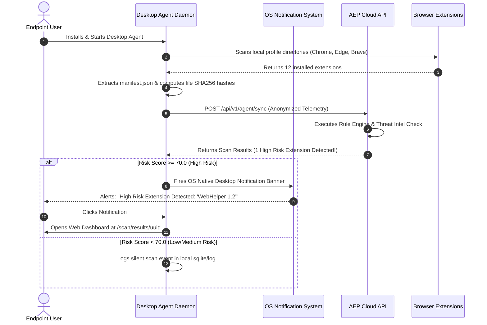
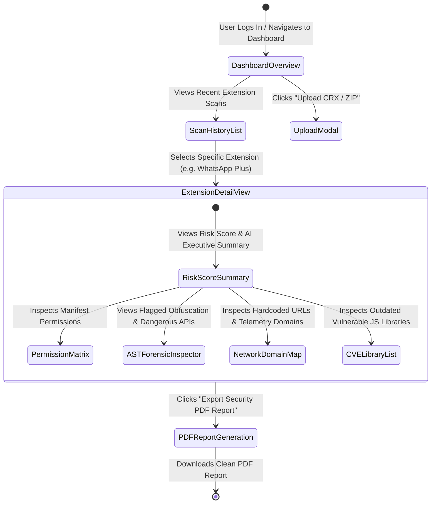
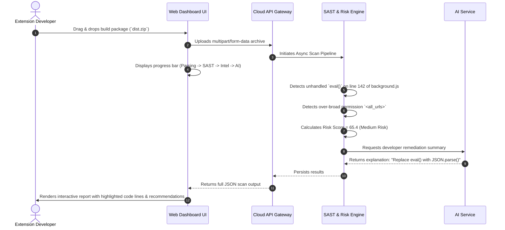
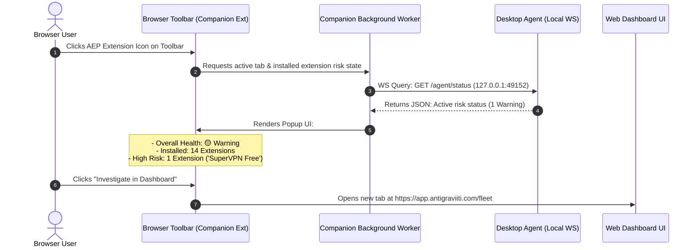

# User Journeys & Flow Diagrams — Antigraviiti Extension Protect (AEP)

---

## 1. Overview of Primary User Journeys

The **Antigraviiti Extension Protect (AEP)** platform accommodates four core user interaction flows across its multi-component ecosystem:

1. **Journey 1: Automated Endpoint Monitoring (Desktop Agent)**
2. **Journey 2: Forensic Investigation & Audit (Web Dashboard)**
3. **Journey 3: Developer Pre-Submission Analysis (Manual Upload)**
4. **Journey 4: In-Browser Quick Status & Alerts (Chrome Companion)**

---

## 2. Journey 1: Automated Endpoint Monitoring (Desktop Agent)

---

## 3. Journey 2: Forensic Investigation & Audit (Web Dashboard)

---

## 4. Journey 3: Developer Pre-Submission Audit (Manual Upload)

---

## 5. Journey 4: In-Browser Quick Status (Chrome Companion Extension)

